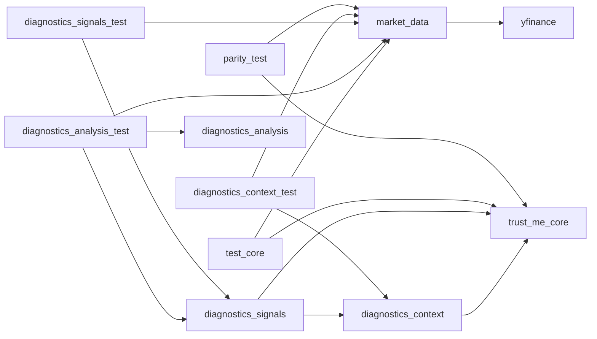
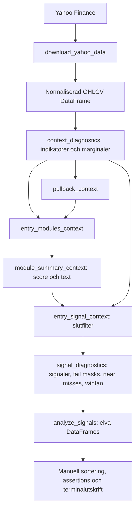

# Trust Me Python – arkitektur

Dokumentförslag, framtaget 2026-09-13 från den lokala arbetskopian, inklusive
befintliga ocommittade filer. Beskriver nuvarande implementation; framtida
förslag är uttryckligen markerade. Ingen strategilogik har ändrats i genomgången.

## 1. Systemets faktiska omfattning

Projektet är en funktionsbaserad Python-port av indikatorer och entryvillkor
med ambition att efterlikna Trust Me/Pine Script. Pandas DataFrames och Series
är gränssnitten mellan beräkningarna. Diagnostiken beskriver varje bar och
analyslagret sammanställer varför signaler uppstår eller blockeras.

Det finns inga klasser, tjänster, databaslager, orderanslutningar eller central
applikationsstart. Körbara exempel och kontroller driver flödet. Pine-källkod
och ett komplett, reproducerbart TradingView-facit finns inte i projektet.
Kommentarer om parity-verifiering är därför inte bevis på fullständig paritet.

| Område | Implementation och status |
| --- | --- |
| Datahämtning | `src/market_data.py`: Yahoo Finance via yfinance |
| Preprocessing | Samma fil: kolumnnormalisering, sortering, sessionsaggregering och separat Daily→intraday-mappning |
| Features/indikatorer | `src/trust_me_core.py`; diagnostiska avstånd och marginaler i `src/diagnostics_context.py` |
| Strategier | Fyra regelbaserade entrymoduler för long/short i `entry_modules_context()` |
| Entries | Modulpoäng och slutliga booleska signaler i core, sammanfogade i `src/diagnostics_signals.py`; inga order/fills |
| Exits | Saknas: ingen exitmotor, stop-loss, take-profit eller trailing stop |
| Risk management | ATR- och candlefilter finns som entryfilter; positionsstorlek, kapitalrisk och portföljgränser saknas |
| ML | Saknas: ingen modell, träning, inferens, labels eller tränings-/testsplit |
| Backtesting | `src/backtest.py` är tom; ingen trade-, kostnads- eller equitysimulering |
| Utvärdering | Signalfrekvens, blockerare, near misses och modultillfällen i `src/diagnostics_analysis.py`; manuella paritykontroller |
| Live-skanning | `src/live_scanner.py` är tom |

### 1.1 Planerad utvecklingsordning

Följande visar både den redan implementerade analyskedjan och planerade nästa
steg. Komponenter efter Opportunity → signal conversion är ännu inte implementerade
om inget annat uttryckligen anges senare i dokumentet.

```text
Core / strategi
      ↓
Context diagnostics
      ↓
Signal diagnostics
      ↓
Diagnostic analysis
      ↓
Opportunity / setup events
      ↓
Opportunity → signal conversion
      ↓
Historical outcome engine
      ↓
Exit / position / risk lifecycle
      ↓
Deterministisk backtestmotor
      ↓
Scanner / watchlist / ranking
      ↓
Predictive analysis / ML
```

Principen är att varje lager ska vara verifierat innan ett senare lager börjar
använda dess output som facit.

ML ska inte implementeras innan följande finns definierat och testat:

- labels och prediction target
- exakt beslutstidpunkt
- feature-tillgänglighet
- train/validation/test-split i tid
- leakage-kontroller
- historiska outcomes
- relevant baseline att jämföra modellen mot

Backtesting ska inte implementeras som enbart en summering av signaler. Innan
backtestmotorn byggs ska kontrakt finnas för entrytid, fill-pris, exits,
positionstillstånd, kostnader och kapitalrisk.

## 2. Fil- och modulkarta

| Fil/katalog | Ansvar och viktiga gränssnitt |
| --- | --- |
| `src/market_data.py` | `validate_ohlcv`, `download_yahoo_data`, `resample_regular_session`, `map_daily_context_to_intraday` |
| `src/trust_me_core.py` | Matematiska primitiver, kontext, entrymoduler, scoring och slutfilter. Importerar bara numpy och pandas |
| `src/diagnostics_context.py` | `context_diagnostics(data, **parametrar)` bygger OHLCV, läge, session, indikatorer och kontinuerliga marginaler: 81 explicit skrivna unika kolumner |
| `src/diagnostics_signals.py` | `signal_diagnostics(df, **parametrar)` återanvänder context och lägger till 110 kolumner för pullback, moduler, signaler och förklaringar; totalt avsett schema 191 kolumner |
| `src/diagnostics_analysis.py` | Tar signaldiagnostikens schema och returnerar elva analystabeller via `analyze_signals()`; hämtar ingen data och beräknar inga indikatorer |
| `src/parity_test.py` | Manuellt körprogram: jämför två hårdkodade MU-bars med aggregerad 45m-data, visar Daily→45m-trend och skriver swingindikatorer |
| `src/backtest.py` | Tom platshållare |
| `src/live_scanner.py` | Tom platshållare |
| `src/__init__.py` | Tom paketmarkör |
| `tests/test_core.py` | 13 syntetiska pytest-tester: OHLCV-validering, trend, regim, volatilitet, momentum, volym, breakout, squeeze, pullback, moduler, score, signal och session |
| `tests/test_market_data.py` | Tom; OHLCV-validering testas i `test_core.py` |
| `tests/diagnostics_context_test.py` | Manuellt `main()`: hämtar MU Daily, kontrollerar kontext på 2026-08-21 och skriver värden |
| `tests/diagnostics_signals_test.py` | Manuellt `main()`: samma datatyp/datum; hårdkodade förväntningar på moduler, masks, signaler och streaks |
| `tests/diagnostics_analysis_test.py` | Manuellt `main()`: två års MU Daily, elva tabeller, eventsammanställningar och konsistensassertions |
| `requirements.txt` | Nio beroenden, utan versionslåsning |
| `README.md` | Tom |
| `.gitignore` | Ignorerar bland annat `.venv`, `.env`, Python-cache, `data/`, `exports/` |
| `data/`, `exports/` | Tomma vid inventeringen; inga implementerade läs-/skrivflöden använder dem |
| `.venv/`, `.pytest_cache/`, `__pycache__/`, `.git/` | Lokal miljö, genererad cache och versionsmetadata; inte applikationsmoduler |

Inga projektägda CI-flöden, byggfiler, notebooks, konfigurationsfiler eller andra
applikationsmoduler hittades utöver inventeringen ovan. Installerade bibliotek
under `.venv` har inte granskats som projektkod.

### Funktionerna i core

| Grupp | Funktioner och ansvar |
| --- | --- |
| Primitiver | `ema`, `sma`, `rma`, `true_range`, `atr`, `dmi_adx`, `rsi`, `crossover`, `crossunder`, `barssince` |
| Trend | `trend_context`: EMA fast/slow och ADX; `trend_regime_context`: riktning med ADX-gräns |
| Volatilitet | `volatility_context`: ATR, ATR i procent, candle range och två entryfilter |
| Momentum | `momentum_context`: RSI, RSI-medel, korsningar och antal bars sedan korsning/överköpt/översålt |
| Volym | `volume_context`: medelvolym och valbart volymfilter |
| Breakout | `breakout_context`: tidigare högsta/lägsta över lookback, exklusive aktuell bar |
| Squeeze | `squeeze_context`: Bollingerband, bandbredd, squeeze och tidsfönster efter squeeze |
| Pullback | `pullback_context`: touch nära snabb EMA och reclaim över/under EMA |
| Entry | `entry_modules_context`: åtta modulsignaler; `module_summary_context`: poäng 0–4 per riktning och modultext |
| Slutfilter | `entry_signal_context`: riktning, score, volatilitet, candle, session, bekräftad bar |
| Session | `session_entry_context`: swing tillåts alltid, intraday följer given mask |

## 3. Beroenden

Pilarna nedan betyder att vänster modul importerar/anropar höger modul.



`diagnostics_analysis` importerar endast pandas, men har ett starkt indirekt
beroende till kolumnnamn och semantik i `diagnostics_signals`. Detta beroende
syns inte i importgrafen. Samtliga implementerade moduler använder pandas;
core använder även numpy. Inga cirkulära interna importer hittades.

`openpyxl`, `python-dotenv`, `requests`, `matplotlib` och `plotly` listas i
requirements men används inte direkt av projektkoden. `pytest` är testverktyg.
Det finns ingen gemensam konfigurationsmodell: standardvärden upprepas i
context, signals, parityprogrammet och manuella testprogram.

## 4. Dataflöde från källa till rapport

### Huvudflöde för diagnostik



1. Ett körprogram väljer ticker, period och interval. Exemplen använder MU,
   oftast två år med Daily-bars.
2. `download_yahoo_data` använder `auto_adjust=False`, `prepost=False` och
   `progress=False`. Eventuella MultiIndex-kolumner plattas ut, OHLCV döps om
   till gemener och övriga kolumner väljs bort. Tom nedladdning ger ValueError.
3. `validate_ohlcv` kräver DatetimeIndex och fem kolumner, sorterar och kopierar.
   Den validerar inte numeriska typer, NaN, dubbletter eller OHLC-konsistens.
4. `context_diagnostics` väljer swing-/intradayparametrar, beräknar kontext på
   inkommande bars och lägger till marginaler. Ingen central warm-up-filtrering
   eller generell imputering utförs.
5. `signal_diagnostics` bygger pullbackvillkor, åtta modulsignaler, score och
   slutliga long/short-signaler. Minsta score är hårdkodat till 1 och samtliga
   bars sätts till `is_confirmed=True`.
6. Samma funktion beskriver blockerare, near misses, masks och väntestreaks.
   Ingen position öppnas och inget tillstånd för innehav lagras.
7. `analyze_signals` aggregerar de färdiga kolumnerna. Körprogrammet skriver
   tabeller till terminalen. Ingen automatisk export eller lagring finns.

### Separat 45m-/HTF-flöde

`parity_test.main` hämtar 15m-bars för 60 dagar och aggregerar dem till 45m.
Sessionen är hårdkodad till 09:30 ≤ tid < 16:00 i `America/New_York`.
Open=första, high=max, low=min, close=sista och volume=summa. Tidsstämpeln är
första observerade underliggande baren; sista normala 45m-baren är partiell.
Det finns ingen börskalender eller kontroll av saknade delbars/halvdagar.

Daily-trend beräknas separat och `map_daily_context_to_intraday` ger föregående
Daily-rad till dagens intraday-bars, utom sista observerade baren som får
dagens Daily-rad. Saknas dagens datum i Daily-input lämnas sessionen som NaN.

**Detta är inte inkopplat i `context_diagnostics`/`signal_diagnostics`.** Namnen
`htf_ema_fast`, `htf_ema_slow` och `htf_adx` i diagnostiken innebär idag trend
på samma upplösning som input. `is_swing=False` ändrar parametrar och
sessionslogik, men hämtar eller mappar inte någon högre tidsupplösning.

## 5. Strategi- och datakontrakt

### Entryregler

Alla fyra longmoduler kräver uptrend och alla shortmoduler kräver downtrend.
Uptrend betyder EMA fast > EMA slow och ADX > vald gräns; short speglar EMA.

| Modul | Ytterligare longkrav | Ytterligare shortkrav |
| --- | --- | --- |
| Pullback | Close över slow EMA, nylig RSI-korsning upp, EMA-touch och reclaim upp | Speglat under EMA/korsning ned/touch/reclaim ned |
| Breakout | Close över tidigare breakoutnivå, stark volym, nylig RSI-korsning upp | Close under breakdownnivå, stark volym, nylig RSI-korsning ned |
| Squeeze | Nylig squeeze, inte fortfarande i squeeze, close över övre BB | Samma squeezekrav, close under undre BB |
| Mean reversion | Close över slow EMA, nyligen RSI < 30, RSI-korsning upp, close > open | Close under slow EMA, nyligen RSI > 70, RSI-korsning ned, close < open |

Slutsignal = riktning tillåten AND score ≥ min_confluence AND volatility_ok
AND not_overextended AND session_ok AND is_confirmed. Aktiva moduler räknas
även när riktningen är avstängd; riktningsfiltret ligger vid slutsignalen.

### Kolumner, index och numerik

- Varje rad representerar en bar. Series som kombineras behöver identiska,
  sorterade index och en gemensam tidszon; pandas alignar efter indexetiketter.
- Resampling och Daily→intraday kräver tidszonsmedveten intradaydata. Daily
  kan vara timezone-naive; mappningen omvandlar Daily-index till datum.
- Funktionerna returnerar nya DataFrames/Series. Schema, typer, index och
  parameterbetydelser är det praktiska API:t; separat schemadefinition saknas.
- EMA använder `ewm(adjust=False)`. RMA seedas med ett SMA av de första giltiga
  värdena. RSI fyller första differensens gain/loss med 0. Ändringar här påverkar
  warm-up och alla efterföljande signaler.
- Bollinger-standardavvikelse använder `ddof=0`. Breakout använder
  `rolling(...).max()/min().shift(1)` för att utesluta aktuell bar.
- Pullback jämför även föregående close med **aktuell** snabb EMA, inte
  föregående EMA. Detta är inte samma uttryck som ett generellt crossover.
- ADX kräver strikt `>`, ATR-procent `>=`, candle range strikt `<` och volym
  strikt `>` medelvolym när filtret är aktivt. Bevara dessa gränser vid ändring.
- NaN från warm-up finns kvar; vissa booleska jämförelser blir False och kan
  räknas som blockerare. Analysprocent använder i regel alla inputbars.

### Stabilt outputschema

Publika DataFrames från diagnostics- och analysislagren ska ha ett stabilt,
dokumenterat schema även när resultatet innehåller noll rader.

En funktion får därför inte normalt returnera en helt kolumnlös DataFrame bara
för att inga observationer matchade villkoret. Konsumenter ska kunna förlita sig
på kolumnnamn och datatyper utan att först veta om resultat finns.

Detta är särskilt viktigt för framtida scannerflöden där många tickers legitimt
kan sakna signaler, near misses eller opportunity events.

Nya analystabeller ska därför definiera sina outputkolumner explicit och testas
för både:

1. resultat med observationer
2. tomt resultat med korrekt schema

### Diagnostikkontrakt

Slutliga fail masks: Direction=1, Score=2, Volatility=4, Candle=8, Session=16,
Confirmed=32. Aktiva modulmasker: Pullback=1, Breakout=2, Squeeze=4, MeanRev=8.
Modulernas fail masks följer respektive ordning:

| Prefix | Bit 1 | Bit 2 | Bit 4 | Bit 8 | Bit 16 |
| --- | --- | --- | --- | --- | --- |
| `pb_*` | Trend | Slow EMA | RSI recent | Touch | Reclaim |
| `bo_*` | Trend | Price | Volume | RSI recent | – |
| `sq_*` | Trend | Recent squeeze | Release | Price | – |
| `mr_*` | Trend | Slow EMA | Oversold/overbought recent | RSI cross | Candle |

En slutlig near miss innebär exakt ett misslyckat slutfilter och ingen signal.
Ett module opportunity event innebär däremot exakt ett misslyckat **modulkrav**
under sammanhängande rader. Blockeraren får bytas inom ett event. Events och
streaks återställs inte uttryckligen vid datum- eller sessionsgränser.

### Analystabeller

| Nyckel/funktion | Tolkning |
| --- | --- |
| `signal_funnel` | Separata barantal per milstolpe/riktning; inte ett strikt kumulativt filterflöde |
| `final_filter_blockers` | Hur ofta varje slutfilter fallerar; samma bar kan räknas flera gånger |
| `final_failure_combinations` | Frekvenser av slutliga fail masks, inklusive mask 0 |
| `near_miss_summary` | Near-missantal, orsaker och statistik över positiva löpande streakvärden |
| `module_failure_analysis` | Misslyckade modulkrav som andel av alla bars |
| `module_activation_summary` | Aktiveringar per modul/riktning före slutfilter |
| `module_conditional_analysis` | Kumulativ funnel i angiven kravordning samt sole blockers när övriga krav passerar |
| `module_opportunity_events` | Start/slut, längd i bars och blockerarsekvens för sammanhängande modultillfällen |
| `opportunity_signal_conversion` | Första efterföljande aktivering av samma modul/riktning inom valt barfönster |
| `opportunity_conversion_summary` | Antal, observerade konverteringar, fullföljda kohorter, procent och väntetider per riktning/modul |
| `opportunity_conversion_by_blocker` | Samma statistik per dominant blocker, normalt minst fem events |

`_rate` returnerar procent 0–100 och 0 när nämnaren är 0. Near-miss-streakens
medelvärde är medel av löpande räknare, inte medellängd av avslutade events.
Inga tabeller visar PnL, Sharpe, drawdown, hit rate eller prediktionskvalitet.

## 6. Filer som måste förstås tillsammans

| Ändringsområde | Läs och samordna dessa filer | Vad som måste hållas konsekvent |
| --- | --- | --- |
| Dataformat, tidszon, aggregation | `market_data.py`, `parity_test.py`, `diagnostics_context.py`, alla datahämtande testprogram | OHLCV, barstämpling, sessionsgränser, Daily-tillgänglighet och index |
| Indikatorer och warm-up | `trust_me_core.py`, `diagnostics_context.py`, `diagnostics_signals.py`, `test_core.py`, parity/context-kontroller | Numerik, gränsvärden, NaN, derivata mått och förväntade signaler |
| Entryvillkor | `trust_me_core.py`, `diagnostics_signals.py`, `diagnostics_analysis.py`, core/signal/analysis-tester | Modulbooleans, motsvarande failvillkor, masks, score och funnels |
| Konfiguration | Context, signals, parity och alla tre manuella diagnostikprogram | Samma parameter vidarebefordras och samma standardvärde avses |
| Sessions-/HTF-stöd | `market_data.py`, core, context, signals och parity | Faktisk tillgänglighet vid beslutstid, sessionmask och bekräftad bar |
| Diagnostikkolumner | Context, signals, analysis och de tre manuella programmen | Kolumnnamn, bool/int/float, maskbitvärden och rapportnycklar |
| Analysdefinitioner | `diagnostics_analysis.py`, `diagnostics_signals.py`, `diagnostics_analysis_test.py` | Nämnare, eventgränser, kravordning och tomma resultat |
| Framtida backtest/exits/risk | Core, signals, market data samt de nya komponenterna | Signal kontra order/fill, beslutstid, positionslivscykel och kostnadsmodell |

De starkaste kopplingarna är alltså inte bara importer: signaldiagnostiken
återger corevillkor som failvillkor, och analyslagret återger modulkrav i flera
definitionstabeller. Alla tre behöver granskas vid en ändring av ett entrykrav.

## 7. Begränsningar och verifierad baslinje

1. `breakout_context` definieras två gånger i core, vid raderna 562 och 1003
   vid genomgången. Python använder den sista. Båda returnerar DataFrame och
   uttrycker samma beräkning nu; dubbeldefinitionen kan dölja framtida ändringar.
2. `trend_regime_context` beskriver `>=` i docstring men använder `>` i kod.
   Context beräknar regim och session separat i stället för att anropa motsvarande
   corefunktioner; detta kan orsaka framtida avvikelser.
3. Signaldiagnostiken tar inte emot contextfunktionens `in_entry_session` eller
   `in_full_session`. Båda blir True som standard, även för intraday. Full-session-
   kolumnen används inte som ett eget slutfilter.
4. `is_confirmed=True` är ett antagande, inte en kontroll att sista nedladdade
   baren faktiskt har stängt. Flödet är därför inte färdigt för livebeslut.
5. Daily-mappningen använder sista **observerade** intradaybar. På avklippta
   sessioner kan dagens Daily-värde då läggas på en för tidig bar. Även på en
   komplett session avser tillgängligheten barens stängning, inte dess startstämpel.
6. Ingen generell validering av sortering/unikhet eller warm-up finns i alla
   lager. Multi-ticker-input stöds inte uttryckligen trots yfinance-normalisering.
7. Event- och konverteringstabeller samt final failure combinations har nu explicit
   schema även vid tomt resultat. Konverteringen kräver unikt stigande DatetimeIndex.
8. Manuella baselinekontroller använder ett fast datum men rullande nedladdade
   historikfönster. Data och indikatorseed kan ändras mellan körningar.
9. Versionslåsning, CI och frysta nätverksoberoende regressionstester saknas.

### Testnivåer framåt

Tester ska skiljas i tre nivåer:

**1. Unit / regression**

Deterministiska och nätverksoberoende tester av matematik, strategi,
diagnostikkontrakt och analystabeller. Dessa ska vara den primära regression-
baslinjen och kunna köras identiskt över tid.

**2. Integration**

Tester av exempelvis Yahoo-data, resampling, sessioner och kompletta dataflöden.
Dessa får vara nätverksberoende och kan påverkas av externa dataleverantörer.

**3. Parity / reference**

Kontroller mot TradingView/Pine eller annat externt facit. Dessa visar likhet mot
referensen för uttryckligen verifierade fall men är inte samma sak som vanliga
unit tests.

På sikt bör nuvarande rullande MU-baselines kompletteras med frysta OHLCV-
fixtures, exempelvis CSV eller Parquet under `tests/fixtures/`. Fixtures ska
innehålla fasta bars och kända förväntade outputs så att förändringar i Yahoo
Finance inte ändrar regressionstesternas facit.

En agent får inte rapportera enbart "alla tester passerar" om endast en av dessa
nivåer har körts. Rapporten ska ange exakt vilka testnivåer och kommandon som
faktiskt kördes.

Verifierat lokalt 2026-09-13:

```sh
PYTHONDONTWRITEBYTECODE=1 .venv/bin/python -m pytest -q -p no:cacheprovider
```

Resultat: **13 passed**. Miljön rapporterade Python 3.12.14, pandas 3.0.5,
numpy 2.5.2, yfinance 1.6.0 och pytest 9.1.1. Detta är en lokal observation,
inte en specificerad miniminivå eller garanti för andra installationer.

Pytest kör inte `main()` i de tre diagnostikprogrammen eller i parityprogrammet.
Deras assertions och nätverksflöden har därför inte verifierats av denna körning.
Ingen Yahoo-nedladdning eller TradingView-verifiering gjordes i genomgången.

## 8. Föreslagen uppdelning mellan Codex-agenter

Rekommenderad form: en samordnare plus högst tre avgränsade implementationer
samtidigt. Fördelningen nedan avser framtida godkänt arbete, inte en påbörjad
refaktorering. En fil har en skrivande ägare åt gången.

| Agent | Primärt ansvar/skrivägarskap | Måste läsa | Leverans |
| --- | --- | --- | --- |
| Samordnare/integration | `AGENTS.md`, `ARCHITECTURE.md`, gemensamma kontrakt; integrationsgranskning | Alla lager och befintlig git-diff | Avgränsade uppgifter, överenskomna scheman, samlad testbedömning |
| Data | `market_data.py`, framtida tester i `test_market_data.py` | Coretrend, context, parity och signalinput | Deterministiska data-/sessions-/HTF-kontrakt och relevanta tester |
| Kärna/strategi | `trust_me_core.py`, `test_core.py` | Context, signalernas failvillkor och analysens kravlistor | Numerik/entrylogik med uttryckliga beteendeändringar och tester |
| Diagnostik/analys | Alla tre `diagnostics_*.py` och motsvarande manuella testprogram | Core och datakontrakt | Konsistenta kolumner, masks, tabeller och gränsfall |

`parity_test.py` får en uttrycklig ägare per uppgift (data vid aggregation,
kärnagent vid indikatorparitet). Dela inte core mellan fyra agenter för varsin
strategi: de skulle skriva i samma fil och gemensamma hjälpfunktioner.

Arbetsordning:

1. Samordnaren dokumenterar aktuellt schema, beteende och befintliga lokala ändringar.
2. Data- och kärnagent kan arbeta parallellt när kontrakten är stabila.
   Diagnostikagent kan samtidigt arbeta med oförändrade scheman och egna fixtures.
3. Vid ändrade kärnvillkor eller schema: färdigställ producentens kontrakt först,
   uppdatera därefter diagnostik och analys samordnat. Undvik konkurrerande ändringar.
4. Varje agent redovisar ändrade filer, kontrakt, testresultat och kvarvarande risker.
   Samordnaren granskar hela kedjan och kör relevanta integrationstester.

Framtida exits/risk/backtest bör först få ett gemensamt beslut om positioner,
order/fill-tid, kostnader och resultatformat. Därefter kan ett separat
simuleringsansvar införas. ML bör vänta tills labels, tidsmässig split och
läckagekontroller är definierade. Ingen sådan implementation ingår idag.


## 9. Opportunity → signal conversion (implementerat 2026-09-13)

`analyze_signals(diagnostics, max_followup_bars=5, blocker_min_events=5)`
returnerar de åtta tidigare tabellerna plus tre nya. Strategin, context,
signals och eventgränserna är oförändrade. Behavior change: YES avser utökade
analysresultat, validering och stabila tomma scheman, inte ändrade entryvillkor.

`opportunity_signal_conversion` återanvänder `module_opportunity_events` och
läser `pullback_*`, `breakout_*`, `squeeze_*`, `mean_rev_*` direkt från
signaldiagnostiken. Ingen alternativ beräkning av modulkraven införs.
Konvertering är första True på samma modul och riktning strikt efter eventslut,
inom H observerade rader (heltal H >= 5). Slutfilter krävs inte;
`final_signal_at_conversion` anger om riktningens slutsignal också var True på
just den baren. Den söker inte en senare slutsignal separat.

Varje event följs självständigt. Ett nytt event eller flera fallerande krav
stoppar inte uppföljningen; samma aktivering kan räknas för flera events.
Detta beskriver efterföljd, inte orsakssamband eller en bestående setup.
Inga kalenderbars skapas, inga sessioner återställs, och luckor räknas inte som
bars. Input måste avse ett instrument, ha unikt stigande DatetimeIndex utan NaT
och icke-saknade booleska modul-/slutsignaler. Tidszon och barstämplar bevaras.
Befintlig warm-up och opportunitylagrets behandling av fail-NaN ändras inte.

Eventtabellens nio kolumner bevaras. Konverteringstabellen lägger till:

| Kolumner | Typ / betydelse |
| --- | --- |
| `max_followup_bars`, `observed_followup_bars` | int64; avsett respektive observerat fönster |
| `followup_complete`, `event_open_at_data_end` | bool; H rader observerade respektive event på sista raden |
| `converted` | nullable boolean; True, False efter fullt fönster, annars NA |
| `conversion_time` | samma datetime-typ/tidszon som index, annars NaT |
| `conversion_bar_position`, `bars_to_conversion` | nullable Int64; nollbaserad inputposition respektive avstånd från eventslut |
| `final_signal_at_conversion` | nullable boolean; NA utan konvertering |
| `converted_within_1_bar`, `converted_within_3_bars`, `converted_within_5_bars` | nullable boolean; True vid observerad träff, False efter fullt delfönster, annars NA |
| `status` | converted / not_converted_within_window / censored |
| `blocker_transition_path` | blocker_sequence med endast intilliggande upprepningar komprimerade |

Konvertering är tillgänglig vid konverteringsbarens stängning
(`available_at = conversion bar close`). Negativt resultat kräver H framtida
barstängningar. Eventets slut kan först bekräftas när nästa bar inte är en
opportunity. Inputstämpeln kan avse barens öppning och är därför inte en exakt
available_at-tidsstämpel. Ett öppet event vid dataslut får preliminärt slut och
censored-status. Endast stängda inputbars ska skickas in; signals kontrollerar
fortfarande inte faktisk stängning. Framtidsinformationen stannar i analysen
och får inte användas som samtidiga features/signaler.

Sammanställningen visar alla åtta riktning/modul-par även utan events.
`opportunity_events` räknar alla events, `converted_events` alla observerade
träffar och `censored_events` okända resultat. `eligible_events` och
`eligible_converted_events` räknar endast events med H observerade följdbars;
`conversion_rate` = 100 * eligible_converted_events / eligible_events.
Även tidiga träffar med ofullständigt fönster utesluts ur denna kvot.
För h=1/3/5 används motsvarande fulla delfönster: `eligible_events_h`,
`converted_events_within_h`, `conversion_rate_within_h`. Olika nämnare betyder
att aggregerade 1/3/5-procent inte nödvändigtvis är monotona.
Noll nämnare ger NaN. Median/medel `*_bars_to_conversion` avser alla observerade
konverteringar och är NaN utan träffar. Detta är inte en överlevnadsanalys.

`opportunity_conversion_summary(..., by_blocker=True, min_events=5)` grupperar
även på dominant_blocker och filtrerar på eventantal. Tröskeln är en enkel
rapportgräns, inte statistisk signifikans. Schemat bevaras även om alla grupper
filtreras bort. Dominant blocker och dess befintliga tie-hantering bevaras.

Blockertransitioner har konkret värde för att skilja upprepad väntan
(Reclaim → Reclaim) från växlande krav (Price → Volume). En kompakt väg och
befintligt blocker_changed räcker för inspektion tillsammans med status.
Ingen separat transitionsmodell införs. Utebliven träff inom fönstret kallas
inte ”avbruten setup”: någon sådan invalideringsregel finns ännu inte.

Deterministiska pytest-tester finns nu även i `tests/diagnostics_analysis_test.py`.
De omfattar alla fyra moduler i båda riktningarna, 1/3/5-gränser, längre fönster,
censurering, öppna events, scheman, blockerbyten, delade aktiveringar och
syntetiskt OHLCV → context → signals → analys med prefixkontroll av kausalitet.
Yahoo-main-programmen och Pine-paritet är separata verifieringsnivåer.
