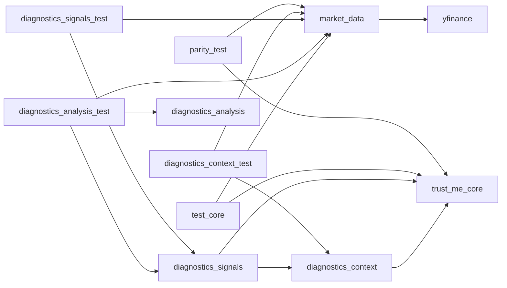
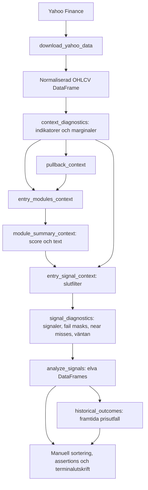

# Trust Me Python – arkitektur

Dokumentförslag, framtaget 2026-09-13 från den lokala arbetskopian, inklusive
befintliga ocommittade filer. Beskriver nuvarande implementation; framtida
förslag är uttryckligen markerade. Ingen strategilogik har ändrats i genomgången.

## 1. Systemets faktiska omfattning

Projektet är en funktionsbaserad Python-port av indikatorer och entryvillkor
med ambition att efterlikna Trust Me/Pine Script. Pandas DataFrames och Series
är gränssnitten mellan beräkningarna. Diagnostiken beskriver varje bar och
analyslagret sammanställer varför signaler uppstår eller blockeras.

Det finns inga klasser, tjänster, databaslager, orderanslutningar eller central
applikationsstart. Körbara exempel och kontroller driver flödet. Pine-källkod
och ett komplett, reproducerbart TradingView-facit finns inte i projektet.
Kommentarer om parity-verifiering är därför inte bevis på fullständig paritet.

| Område | Implementation och status |
| --- | --- |
| Datahämtning | `src/market_data.py`: Yahoo Finance via yfinance |
| Preprocessing | Samma fil: kolumnnormalisering, sortering, sessionsaggregering och separat Daily→intraday-mappning |
| Features/indikatorer | `src/trust_me_core.py`; diagnostiska avstånd och marginaler i `src/diagnostics_context.py` |
| Strategier | Fyra regelbaserade entrymoduler för long/short i `entry_modules_context()` |
| Entries | Modulpoäng och slutliga booleska signaler i core, sammanfogade i `src/diagnostics_signals.py`; research-fills för Swing i `src/backtest.py` |
| Exits | Deterministisk Swing research-modell med kausalt ATR-stop och trendexit; ingen live-exekvering |
| Risk management | ATR- och candlefilter finns som entryfilter; positionsstorlek, kapitalrisk och portföljgränser saknas |
| ML | Saknas: ingen modell, träning, inferens, labels eller tränings-/testsplit |
| Backtesting | `src/backtest.py` simulerar en position åt gången för Swing och ger trade ledger, state trace och closed-trade summary; ingen kapital-/kostnadsmodell |
| Utvärdering | Signalfrekvens, blockerare, near misses och modultillfällen i `src/diagnostics_analysis.py`; retrospektiva prisoutcomes i `src/historical_outcomes.py`; manuella paritykontroller |
| Live-skanning | `src/live_scanner.py` är tom |

### 1.1 Planerad utvecklingsordning

Följande visar både den redan implementerade analyskedjan och planerade nästa
steg. Komponenter efter Opportunity → signal conversion är ännu inte implementerade
om inget annat uttryckligen anges senare i dokumentet.

```text
Core / strategi
      ↓
Context diagnostics
      ↓
Signal diagnostics
      ↓
Diagnostic analysis
      ↓
Opportunity / setup events
      ↓
Opportunity → signal conversion
      ↓
Historical Outcome Engine          ✅
      ↓
Research Execution Contract        ✅
      ↓
Deterministic Swing Backtest       ✅
      ↓
Strategy Evaluation                ✅
      ↓
Trade Lifecycle + Signal → Fill    ✅
      ↓
A/B Rule Testing                   ✅
      ↓
Walk-forward / Out-of-sample       ← NÄSTA
      ↓
Scanner / watchlist / ranking
      ↓
Predictive analysis / ML
```

Principen är att varje lager ska vara verifierat innan ett senare lager börjar
använda dess output som facit.

ML ska inte implementeras innan följande finns definierat och testat:

- labels och prediction target
- exakt beslutstidpunkt
- feature-tillgänglighet
- train/validation/test-split i tid
- leakage-kontroller
- historiska outcomes
- relevant baseline att jämföra modellen mot

Backtesting ska inte implementeras som enbart en summering av signaler. Innan
backtestmotorn byggs ska kontrakt finnas för entrytid, fill-pris, exits,
positionstillstånd, kostnader och kapitalrisk.

## 2. Fil- och modulkarta

| Fil/katalog | Ansvar och viktiga gränssnitt |
| --- | --- |
| `src/market_data.py` | `validate_ohlcv`, `download_yahoo_data`, `resample_regular_session`, `map_daily_context_to_intraday` |
| `src/trust_me_core.py` | Matematiska primitiver, kontext, entrymoduler, scoring och slutfilter. Importerar bara numpy och pandas |
| `src/diagnostics_context.py` | `context_diagnostics(data, **parametrar)` bygger OHLCV, läge, session, indikatorer och kontinuerliga marginaler: 81 explicit skrivna unika kolumner |
| `src/diagnostics_signals.py` | `signal_diagnostics(df, **parametrar)` återanvänder context och lägger till 110 kolumner för pullback, moduler, signaler och förklaringar; totalt avsett schema 191 kolumner |
| `src/diagnostics_analysis.py` | Tar signaldiagnostikens schema och returnerar elva analystabeller via `analyze_signals()`; hämtar ingen data och beräknar inga indikatorer |
| `src/historical_outcomes.py` | Bygger aktiverings-/opportunity-observationer, mäter kausalt avgränsade framtida prisoutcomes och returnerar tre aggregerade diagnostikvyer |
| `src/parity_test.py` | Manuellt körprogram: jämför två hårdkodade MU-bars med aggregerad 45m-data, visar Daily→45m-trend och skriver swingindikatorer |
| `src/backtest.py` | Kausal deterministisk Swing research-backtest: next-open fills, ATR/trendexits, trade ledger, state trace och closed-trade summary |
| `src/strategy_evaluation.py` | Deskriptiv Strategy Evaluation: total-, riktnings- och modulattribuerad trade-performance, approved-vs-blocked paths samt MFE/MAE jämfört med realiserat trade-resultat |
| `src/trade_lifecycle.py` | Faktisk holding-period MFE/MAE med osäkerhetsintervall, stopförlopp och separat post-exit-observation |
| `src/ab_rule_testing.py` | Deterministisk A/B-replay av baseline och en isolerad execution-konfigurationsändring, med performance-, signal/execution-, lifecycle- och paired-vyer |
| `src/live_scanner.py` | Tom platshållare |
| `src/__init__.py` | Tom paketmarkör |
| `tests/test_core.py` | 13 syntetiska pytest-tester: OHLCV-validering, trend, regim, volatilitet, momentum, volym, breakout, squeeze, pullback, moduler, score, signal och session |
| `tests/test_market_data.py` | Tom; OHLCV-validering testas i `test_core.py` |
| `tests/test_strategy_evaluation.py` | Deterministiska tester av performancegrupper, censurering, approved/blocked, excursion-matchning, tomma scheman och tidszon |
| `tests/diagnostics_context_test.py` | Manuellt `main()`: hämtar MU Daily, kontrollerar kontext på 2026-08-21 och skriver värden |
| `tests/diagnostics_signals_test.py` | Manuellt `main()`: samma datatyp/datum; hårdkodade förväntningar på moduler, masks, signaler och streaks |
| `tests/diagnostics_analysis_test.py` | Manuellt `main()`: två års MU Daily, elva tabeller, eventsammanställningar och konsistensassertions |
| `requirements.txt` | Nio beroenden, utan versionslåsning |
| `README.md` | Tom |
| `.gitignore` | Ignorerar bland annat `.venv`, `.env`, Python-cache, `data/`, `exports/` |
| `data/`, `exports/` | Tomma vid inventeringen; inga implementerade läs-/skrivflöden använder dem |
| `.venv/`, `.pytest_cache/`, `__pycache__/`, `.git/` | Lokal miljö, genererad cache och versionsmetadata; inte applikationsmoduler |

Inga projektägda CI-flöden, byggfiler, notebooks, konfigurationsfiler eller andra
applikationsmoduler hittades utöver inventeringen ovan. Installerade bibliotek
under `.venv` har inte granskats som projektkod.

### Funktionerna i core

| Grupp | Funktioner och ansvar |
| --- | --- |
| Primitiver | `ema`, `sma`, `rma`, `true_range`, `atr`, `dmi_adx`, `rsi`, `crossover`, `crossunder`, `barssince` |
| Trend | `trend_context`: EMA fast/slow och ADX; `trend_regime_context`: riktning med ADX-gräns |
| Volatilitet | `volatility_context`: ATR, ATR i procent, candle range och två entryfilter |
| Momentum | `momentum_context`: RSI, RSI-medel, korsningar och antal bars sedan korsning/överköpt/översålt |
| Volym | `volume_context`: medelvolym och valbart volymfilter |
| Breakout | `breakout_context`: tidigare högsta/lägsta över lookback, exklusive aktuell bar |
| Squeeze | `squeeze_context`: Bollingerband, bandbredd, squeeze och tidsfönster efter squeeze |
| Pullback | `pullback_context`: touch nära snabb EMA och reclaim över/under EMA |
| Entry | `entry_modules_context`: åtta modulsignaler; `module_summary_context`: poäng 0–4 per riktning och modultext |
| Slutfilter | `entry_signal_context`: riktning, score, volatilitet, candle, session, bekräftad bar |
| Session | `session_entry_context`: swing tillåts alltid, intraday följer given mask |

## 3. Beroenden

Pilarna nedan betyder att vänster modul importerar/anropar höger modul.



`diagnostics_analysis` importerar endast pandas, men har ett starkt indirekt
beroende till kolumnnamn och semantik i `diagnostics_signals`. Detta beroende
syns inte i importgrafen. Samtliga implementerade moduler använder pandas;
core använder även numpy. Inga cirkulära interna importer hittades.

`openpyxl`, `python-dotenv`, `requests`, `matplotlib` och `plotly` listas i
requirements men används inte direkt av projektkoden. `pytest` är testverktyg.
Det finns ingen gemensam konfigurationsmodell: standardvärden upprepas i
context, signals, parityprogrammet och manuella testprogram.

## 4. Dataflöde från källa till rapport

### Huvudflöde för diagnostik



1. Ett körprogram väljer ticker, period och interval. Exemplen använder MU,
   oftast två år med Daily-bars.
2. `download_yahoo_data` använder `auto_adjust=False`, `prepost=False` och
   `progress=False`. Eventuella MultiIndex-kolumner plattas ut, OHLCV döps om
   till gemener och övriga kolumner väljs bort. Tom nedladdning ger ValueError.
3. `validate_ohlcv` kräver DatetimeIndex och fem kolumner, sorterar och kopierar.
   Den validerar inte numeriska typer, NaN, dubbletter eller OHLC-konsistens.
4. `context_diagnostics` väljer swing-/intradayparametrar, beräknar kontext på
   inkommande bars och lägger till marginaler. Ingen central warm-up-filtrering
   eller generell imputering utförs.
5. `signal_diagnostics` bygger pullbackvillkor, åtta modulsignaler, score och
   slutliga long/short-signaler. Minsta score är hårdkodat till 1 och samtliga
   bars sätts till `is_confirmed=True`.
6. Samma funktion beskriver blockerare, near misses, masks och väntestreaks.
   Ingen position öppnas och inget tillstånd för innehav lagras.
7. `analyze_signals` aggregerar de färdiga kolumnerna. Körprogrammet skriver
   tabeller till terminalen. Ingen automatisk export eller lagring finns.

### Separat 45m-/HTF-flöde

`parity_test.main` hämtar 15m-bars för 60 dagar och aggregerar dem till 45m.
Sessionen är hårdkodad till 09:30 ≤ tid < 16:00 i `America/New_York`.
Open=första, high=max, low=min, close=sista och volume=summa. Tidsstämpeln är
första observerade underliggande baren; sista normala 45m-baren är partiell.
Det finns ingen börskalender eller kontroll av saknade delbars/halvdagar.

Daily-trend beräknas separat och `map_daily_context_to_intraday` ger föregående
Daily-rad till dagens intraday-bars, utom sista observerade baren som får
dagens Daily-rad. Saknas dagens datum i Daily-input lämnas sessionen som NaN.

**Detta är inte inkopplat i `context_diagnostics`/`signal_diagnostics`.** Namnen
`htf_ema_fast`, `htf_ema_slow` och `htf_adx` i diagnostiken innebär idag trend
på samma upplösning som input. `is_swing=False` ändrar parametrar och
sessionslogik, men hämtar eller mappar inte någon högre tidsupplösning.

## 5. Strategi- och datakontrakt

### Entryregler

Alla fyra longmoduler kräver uptrend och alla shortmoduler kräver downtrend.
Uptrend betyder EMA fast > EMA slow och ADX > vald gräns; short speglar EMA.

| Modul | Ytterligare longkrav | Ytterligare shortkrav |
| --- | --- | --- |
| Pullback | Close över slow EMA, nylig RSI-korsning upp, EMA-touch och reclaim upp | Speglat under EMA/korsning ned/touch/reclaim ned |
| Breakout | Close över tidigare breakoutnivå, stark volym, nylig RSI-korsning upp | Close under breakdownnivå, stark volym, nylig RSI-korsning ned |
| Squeeze | Nylig squeeze, inte fortfarande i squeeze, close över övre BB | Samma squeezekrav, close under undre BB |
| Mean reversion | Close över slow EMA, nyligen RSI < 30, RSI-korsning upp, close > open | Close under slow EMA, nyligen RSI > 70, RSI-korsning ned, close < open |

Slutsignal = riktning tillåten AND score ≥ min_confluence AND volatility_ok
AND not_overextended AND session_ok AND is_confirmed. Aktiva moduler räknas
även när riktningen är avstängd; riktningsfiltret ligger vid slutsignalen.

### Kolumner, index och numerik

- Varje rad representerar en bar. Series som kombineras behöver identiska,
  sorterade index och en gemensam tidszon; pandas alignar efter indexetiketter.
- Resampling och Daily→intraday kräver tidszonsmedveten intradaydata. Daily
  kan vara timezone-naive; mappningen omvandlar Daily-index till datum.
- Funktionerna returnerar nya DataFrames/Series. Schema, typer, index och
  parameterbetydelser är det praktiska API:t; separat schemadefinition saknas.
- EMA använder `ewm(adjust=False)`. RMA seedas med ett SMA av de första giltiga
  värdena. RSI fyller första differensens gain/loss med 0. Ändringar här påverkar
  warm-up och alla efterföljande signaler.
- Bollinger-standardavvikelse använder `ddof=0`. Breakout använder
  `rolling(...).max()/min().shift(1)` för att utesluta aktuell bar.
- Pullback jämför även föregående close med **aktuell** snabb EMA, inte
  föregående EMA. Detta är inte samma uttryck som ett generellt crossover.
- ADX kräver strikt `>`, ATR-procent `>=`, candle range strikt `<` och volym
  strikt `>` medelvolym när filtret är aktivt. Bevara dessa gränser vid ändring.
- NaN från warm-up finns kvar; vissa booleska jämförelser blir False och kan
  räknas som blockerare. Analysprocent använder i regel alla inputbars.

### Stabilt outputschema

Publika DataFrames från diagnostics- och analysislagren ska ha ett stabilt,
dokumenterat schema även när resultatet innehåller noll rader.

En funktion får därför inte normalt returnera en helt kolumnlös DataFrame bara
för att inga observationer matchade villkoret. Konsumenter ska kunna förlita sig
på kolumnnamn och datatyper utan att först veta om resultat finns.

Detta är särskilt viktigt för framtida scannerflöden där många tickers legitimt
kan sakna signaler, near misses eller opportunity events.

Nya analystabeller ska därför definiera sina outputkolumner explicit och testas
för både:

1. resultat med observationer
2. tomt resultat med korrekt schema

### Diagnostikkontrakt

Slutliga fail masks: Direction=1, Score=2, Volatility=4, Candle=8, Session=16,
Confirmed=32. Aktiva modulmasker: Pullback=1, Breakout=2, Squeeze=4, MeanRev=8.
Modulernas fail masks följer respektive ordning:

| Prefix | Bit 1 | Bit 2 | Bit 4 | Bit 8 | Bit 16 |
| --- | --- | --- | --- | --- | --- |
| `pb_*` | Trend | Slow EMA | RSI recent | Touch | Reclaim |
| `bo_*` | Trend | Price | Volume | RSI recent | – |
| `sq_*` | Trend | Recent squeeze | Release | Price | – |
| `mr_*` | Trend | Slow EMA | Oversold/overbought recent | RSI cross | Candle |

En slutlig near miss innebär exakt ett misslyckat slutfilter och ingen signal.
Ett module opportunity event innebär däremot exakt ett misslyckat **modulkrav**
under sammanhängande rader. Blockeraren får bytas inom ett event. Events och
streaks återställs inte uttryckligen vid datum- eller sessionsgränser.

### Analystabeller

| Nyckel/funktion | Tolkning |
| --- | --- |
| `signal_funnel` | Separata barantal per milstolpe/riktning; inte ett strikt kumulativt filterflöde |
| `final_filter_blockers` | Hur ofta varje slutfilter fallerar; samma bar kan räknas flera gånger |
| `final_failure_combinations` | Frekvenser av slutliga fail masks, inklusive mask 0 |
| `near_miss_summary` | Near-missantal, orsaker och statistik över positiva löpande streakvärden |
| `module_failure_analysis` | Misslyckade modulkrav som andel av alla bars |
| `module_activation_summary` | Aktiveringar per modul/riktning före slutfilter |
| `module_conditional_analysis` | Kumulativ funnel i angiven kravordning samt sole blockers när övriga krav passerar |
| `module_opportunity_events` | Start/slut, längd i bars och blockerarsekvens för sammanhängande modultillfällen |
| `opportunity_signal_conversion` | Första efterföljande aktivering av samma modul/riktning inom valt barfönster |
| `opportunity_conversion_summary` | Antal, observerade konverteringar, fullföljda kohorter, procent och väntetider per riktning/modul |
| `opportunity_conversion_by_blocker` | Samma statistik per dominant blocker, normalt minst fem events |

`_rate` returnerar procent 0–100 och 0 när nämnaren är 0. Near-miss-streakens
medelvärde är medel av löpande räknare, inte medellängd av avslutade events.
Inga tabeller visar PnL, Sharpe, drawdown, hit rate eller prediktionskvalitet.

## 6. Filer som måste förstås tillsammans

| Ändringsområde | Läs och samordna dessa filer | Vad som måste hållas konsekvent |
| --- | --- | --- |
| Dataformat, tidszon, aggregation | `market_data.py`, `parity_test.py`, `diagnostics_context.py`, alla datahämtande testprogram | OHLCV, barstämpling, sessionsgränser, Daily-tillgänglighet och index |
| Indikatorer och warm-up | `trust_me_core.py`, `diagnostics_context.py`, `diagnostics_signals.py`, `test_core.py`, parity/context-kontroller | Numerik, gränsvärden, NaN, derivata mått och förväntade signaler |
| Entryvillkor | `trust_me_core.py`, `diagnostics_signals.py`, `diagnostics_analysis.py`, core/signal/analysis-tester | Modulbooleans, motsvarande failvillkor, masks, score och funnels |
| Konfiguration | Context, signals, parity och alla tre manuella diagnostikprogram | Samma parameter vidarebefordras och samma standardvärde avses |
| Sessions-/HTF-stöd | `market_data.py`, core, context, signals och parity | Faktisk tillgänglighet vid beslutstid, sessionmask och bekräftad bar |
| Diagnostikkolumner | Context, signals, analysis och de tre manuella programmen | Kolumnnamn, bool/int/float, maskbitvärden och rapportnycklar |
| Analysdefinitioner | `diagnostics_analysis.py`, `diagnostics_signals.py`, `diagnostics_analysis_test.py` | Nämnare, eventgränser, kravordning och tomma resultat |
| Framtida backtest/exits/risk | Core, signals, market data samt de nya komponenterna | Signal kontra order/fill, beslutstid, positionslivscykel och kostnadsmodell |

De starkaste kopplingarna är alltså inte bara importer: signaldiagnostiken
återger corevillkor som failvillkor, och analyslagret återger modulkrav i flera
definitionstabeller. Alla tre behöver granskas vid en ändring av ett entrykrav.

## 7. Begränsningar och verifierad baslinje

1. `breakout_context` definieras två gånger i core, vid raderna 562 och 1003
   vid genomgången. Python använder den sista. Båda returnerar DataFrame och
   uttrycker samma beräkning nu; dubbeldefinitionen kan dölja framtida ändringar.
2. `trend_regime_context` beskriver `>=` i docstring men använder `>` i kod.
   Context beräknar regim och session separat i stället för att anropa motsvarande
   corefunktioner; detta kan orsaka framtida avvikelser.
3. Signaldiagnostiken tar inte emot contextfunktionens `in_entry_session` eller
   `in_full_session`. Båda blir True som standard, även för intraday. Full-session-
   kolumnen används inte som ett eget slutfilter.
4. `is_confirmed=True` är ett antagande, inte en kontroll att sista nedladdade
   baren faktiskt har stängt. Flödet är därför inte färdigt för livebeslut.
5. Daily-mappningen använder sista **observerade** intradaybar. På avklippta
   sessioner kan dagens Daily-värde då läggas på en för tidig bar. Även på en
   komplett session avser tillgängligheten barens stängning, inte dess startstämpel.
6. Ingen generell validering av sortering/unikhet eller warm-up finns i alla
   lager. Multi-ticker-input stöds inte uttryckligen trots yfinance-normalisering.
7. Event- och konverteringstabeller samt final failure combinations har nu explicit
   schema även vid tomt resultat. Konverteringen kräver unikt stigande DatetimeIndex.
8. Manuella baselinekontroller använder ett fast datum men rullande nedladdade
   historikfönster. Data och indikatorseed kan ändras mellan körningar.
9. Versionslåsning, CI och frysta nätverksoberoende regressionstester saknas.

### Testnivåer framåt

Tester ska skiljas i tre nivåer:

**1. Unit / regression**

Deterministiska och nätverksoberoende tester av matematik, strategi,
diagnostikkontrakt och analystabeller. Dessa ska vara den primära regression-
baslinjen och kunna köras identiskt över tid.

**2. Integration**

Tester av exempelvis Yahoo-data, resampling, sessioner och kompletta dataflöden.
Dessa får vara nätverksberoende och kan påverkas av externa dataleverantörer.

**3. Parity / reference**

Kontroller mot TradingView/Pine eller annat externt facit. Dessa visar likhet mot
referensen för uttryckligen verifierade fall men är inte samma sak som vanliga
unit tests.

På sikt bör nuvarande rullande MU-baselines kompletteras med frysta OHLCV-
fixtures, exempelvis CSV eller Parquet under `tests/fixtures/`. Fixtures ska
innehålla fasta bars och kända förväntade outputs så att förändringar i Yahoo
Finance inte ändrar regressionstesternas facit.

En agent får inte rapportera enbart "alla tester passerar" om endast en av dessa
nivåer har körts. Rapporten ska ange exakt vilka testnivåer och kommandon som
faktiskt kördes.

Verifierat lokalt 2026-09-13:

```sh
PYTHONDONTWRITEBYTECODE=1 .venv/bin/python -m pytest -q -p no:cacheprovider
```

Resultat: **13 passed**. Miljön rapporterade Python 3.12.14, pandas 3.0.5,
numpy 2.5.2, yfinance 1.6.0 och pytest 9.1.1. Detta är en lokal observation,
inte en specificerad miniminivå eller garanti för andra installationer.

Pytest kör inte `main()` i de tre diagnostikprogrammen eller i parityprogrammet.
Deras assertions och nätverksflöden har därför inte verifierats av denna körning.
Ingen Yahoo-nedladdning eller TradingView-verifiering gjordes i genomgången.

## 8. Föreslagen uppdelning mellan Codex-agenter

Rekommenderad form: en samordnare plus högst tre avgränsade implementationer
samtidigt. Fördelningen nedan avser framtida godkänt arbete, inte en påbörjad
refaktorering. En fil har en skrivande ägare åt gången.

| Agent | Primärt ansvar/skrivägarskap | Måste läsa | Leverans |
| --- | --- | --- | --- |
| Samordnare/integration | `AGENTS.md`, `ARCHITECTURE.md`, gemensamma kontrakt; integrationsgranskning | Alla lager och befintlig git-diff | Avgränsade uppgifter, överenskomna scheman, samlad testbedömning |
| Data | `market_data.py`, framtida tester i `test_market_data.py` | Coretrend, context, parity och signalinput | Deterministiska data-/sessions-/HTF-kontrakt och relevanta tester |
| Kärna/strategi | `trust_me_core.py`, `test_core.py` | Context, signalernas failvillkor och analysens kravlistor | Numerik/entrylogik med uttryckliga beteendeändringar och tester |
| Diagnostik/analys | Alla tre `diagnostics_*.py` och motsvarande manuella testprogram | Core och datakontrakt | Konsistenta kolumner, masks, tabeller och gränsfall |

`parity_test.py` får en uttrycklig ägare per uppgift (data vid aggregation,
kärnagent vid indikatorparitet). Dela inte core mellan fyra agenter för varsin
strategi: de skulle skriva i samma fil och gemensamma hjälpfunktioner.

Arbetsordning:

1. Samordnaren dokumenterar aktuellt schema, beteende och befintliga lokala ändringar.
2. Data- och kärnagent kan arbeta parallellt när kontrakten är stabila.
   Diagnostikagent kan samtidigt arbeta med oförändrade scheman och egna fixtures.
3. Vid ändrade kärnvillkor eller schema: färdigställ producentens kontrakt först,
   uppdatera därefter diagnostik och analys samordnat. Undvik konkurrerande ändringar.
4. Varje agent redovisar ändrade filer, kontrakt, testresultat och kvarvarande risker.
   Samordnaren granskar hela kedjan och kör relevanta integrationstester.

Framtida exits/risk/backtest bör först få ett gemensamt beslut om positioner,
order/fill-tid, kostnader och resultatformat. Därefter kan ett separat
simuleringsansvar införas. ML bör vänta tills labels, tidsmässig split och
läckagekontroller är definierade. Ingen sådan implementation ingår idag.


## 9. Opportunity → signal conversion (implementerat 2026-09-13)

`analyze_signals(diagnostics, max_followup_bars=5, blocker_min_events=5)`
returnerar de åtta tidigare tabellerna plus tre nya. Strategin, context,
signals och eventgränserna är oförändrade. Behavior change: YES avser utökade
analysresultat, validering och stabila tomma scheman, inte ändrade entryvillkor.

`opportunity_signal_conversion` återanvänder `module_opportunity_events` och
läser `pullback_*`, `breakout_*`, `squeeze_*`, `mean_rev_*` direkt från
signaldiagnostiken. Ingen alternativ beräkning av modulkraven införs.
Konvertering är första True på samma modul och riktning strikt efter eventslut,
inom H observerade rader (heltal H >= 5). Slutfilter krävs inte;
`final_signal_at_conversion` anger om riktningens slutsignal också var True på
just den baren. Den söker inte en senare slutsignal separat.

Varje event följs självständigt. Ett nytt event eller flera fallerande krav
stoppar inte uppföljningen; samma aktivering kan räknas för flera events.
Detta beskriver efterföljd, inte orsakssamband eller en bestående setup.
Inga kalenderbars skapas, inga sessioner återställs, och luckor räknas inte som
bars. Input måste avse ett instrument, ha unikt stigande DatetimeIndex utan NaT
och icke-saknade booleska modul-/slutsignaler. Tidszon och barstämplar bevaras.
Befintlig warm-up och opportunitylagrets behandling av fail-NaN ändras inte.

Eventtabellens nio kolumner bevaras. Konverteringstabellen lägger till:

| Kolumner | Typ / betydelse |
| --- | --- |
| `max_followup_bars`, `observed_followup_bars` | int64; avsett respektive observerat fönster |
| `followup_complete`, `event_open_at_data_end` | bool; H rader observerade respektive event på sista raden |
| `converted` | nullable boolean; True, False efter fullt fönster, annars NA |
| `conversion_time` | samma datetime-typ/tidszon som index, annars NaT |
| `conversion_bar_position`, `bars_to_conversion` | nullable Int64; nollbaserad inputposition respektive avstånd från eventslut |
| `final_signal_at_conversion` | nullable boolean; NA utan konvertering |
| `converted_within_1_bar`, `converted_within_3_bars`, `converted_within_5_bars` | nullable boolean; True vid observerad träff, False efter fullt delfönster, annars NA |
| `status` | converted / not_converted_within_window / censored |
| `blocker_transition_path` | blocker_sequence med endast intilliggande upprepningar komprimerade |

Konvertering är tillgänglig vid konverteringsbarens stängning
(`available_at = conversion bar close`). Negativt resultat kräver H framtida
barstängningar. Eventets slut kan först bekräftas när nästa bar inte är en
opportunity. Inputstämpeln kan avse barens öppning och är därför inte en exakt
available_at-tidsstämpel. Ett öppet event vid dataslut får preliminärt slut och
censored-status. Endast stängda inputbars ska skickas in; signals kontrollerar
fortfarande inte faktisk stängning. Framtidsinformationen stannar i analysen
och får inte användas som samtidiga features/signaler.

Sammanställningen visar alla åtta riktning/modul-par även utan events.
`opportunity_events` räknar alla events, `converted_events` alla observerade
träffar och `censored_events` okända resultat. `eligible_events` och
`eligible_converted_events` räknar endast events med H observerade följdbars;
`conversion_rate` = 100 * eligible_converted_events / eligible_events.
Även tidiga träffar med ofullständigt fönster utesluts ur denna kvot.
För h=1/3/5 används motsvarande fulla delfönster: `eligible_events_h`,
`converted_events_within_h`, `conversion_rate_within_h`. Olika nämnare betyder
att aggregerade 1/3/5-procent inte nödvändigtvis är monotona.
Noll nämnare ger NaN. Median/medel `*_bars_to_conversion` avser alla observerade
konverteringar och är NaN utan träffar. Detta är inte en överlevnadsanalys.

`opportunity_conversion_summary(..., by_blocker=True, min_events=5)` grupperar
även på dominant_blocker och filtrerar på eventantal. Tröskeln är en enkel
rapportgräns, inte statistisk signifikans. Schemat bevaras även om alla grupper
filtreras bort. Dominant blocker och dess befintliga tie-hantering bevaras.

Blockertransitioner har konkret värde för att skilja upprepad väntan
(Reclaim → Reclaim) från växlande krav (Price → Volume). En kompakt väg och
befintligt blocker_changed räcker för inspektion tillsammans med status.
Ingen separat transitionsmodell införs. Utebliven träff inom fönstret kallas
inte ”avbruten setup”: någon sådan invalideringsregel finns ännu inte.

Deterministiska pytest-tester finns nu även i `tests/diagnostics_analysis_test.py`.
De omfattar alla fyra moduler i båda riktningarna, 1/3/5-gränser, längre fönster,
censurering, öppna events, scheman, blockerbyten, delade aktiveringar och
syntetiskt OHLCV → context → signals → analys med prefixkontroll av kausalitet.
Yahoo-main-programmen och Pine-paritet är separata verifieringsnivåer.

## 10. Historical outcome engine (implementerat 2026-09-13)

`src/historical_outcomes.py` är ett separat, retrospektivt analyslager efter
signal- och eventdiagnostiken. Det ändrar eller räknar inte om entrykrav,
moduler, score eller slutfilter. `analyze_historical_outcomes` returnerar råa
outcomes samt sammanställningar per riktning/modul/sample type, per dominant
blocker och för full aktivering jämförd med varje sole blocker. Inga grupper
filtreras på sample size. Resultaten är observationella och stödjer inte i sig
kausala påståenden om en blockerare.

### Observationer och tid

En `Module Activation` skapas direkt från en True-rad i någon av de åtta
befintliga modulkolumnerna. Dess `anchor_time` är aktiveringsbarens label och
`anchor_price` dess close. En `Opportunity Event` återanvänder eventtabellen,
inklusive dominant blocker, blockerbyten och eventuell konverteringsmetadata;
dess anchor är `event_end` och close på den raden. Indexets datetime-typ och
tidszon bevaras i timestampkolumner, även för tomma resultat.

För båda typerna gäller **`available_at = anchor bar close`**. Anchor close är
ett analytiskt referenspris, inte fill eller faktisk trade-entry. Alla outcomes
använder endast observerade inputrader `anchor+1 ... anchor+h`; anchor-barens
high/low ingår aldrig. Bars betyder rader, inte förfluten kalendertid. Lagret är
framtidsvetande diagnostik och får inte återkopplas som samtidig signalfeature.

### Exakta outcome-definitioner

För riktningstecken `s=+1` Long och `s=-1` Short är forward return efter `h`
bars `s * (close[t+h] / anchor_price - 1)`. Long MFE är högsta
`high/anchor_price-1` och Long MAE lägsta `low/anchor_price-1` i hela det
framtida fönstret. Short MFE är högsta `1-low/anchor_price` och Short MAE lägsta
`1-high/anchor_price`. Därmed är gynnsam excursion positiv och ogynnsam
excursion negativ för båda riktningarna. Standardhorisonterna är 1, 3, 5, 10
och 20 bars. Ett mått är NA och `complete_h=False` om samtliga h framtida rows
inte finns; det räknas som censurerat, inte som misslyckande.

Target/stop-par är konfigurerbara och är som standard +3%/-2% och +5%/-3%.
De följs som standard till största valda horisont, eller till explicit
`path_horizon`. Första träffbar för vardera nivå rapporteras från 1. Om båda
nivåerna först träffas i samma OHLC-bar blir `path_status=AMBIGUOUS`: båda
hit-flaggorna är True men target-before-stop och stop-before-target är NA
eftersom ordningen är okänd. I övrigt används `TARGET_BEFORE_STOP`,
`STOP_BEFORE_TARGET`, `NEITHER`
hit-flaggorna är True men varken target-before-stop eller stop-before-target är
True. I övrigt används `TARGET_BEFORE_STOP`, `STOP_BEFORE_TARGET`, `NEITHER`
efter ett komplett fönster eller `CENSORED` för ett ofullständigt olöst fönster.
Ingen intrabarordning antas.

Aggregeringarna rapporterar alltid `sample_size`, fullständiga samples och
censurerade samples per horisont, medel/median för forward return, MFE och MAE,
samt target-before-stop-rate bland statusarna `TARGET_BEFORE_STOP`,
`STOP_BEFORE_TARGET` och `NEITHER`. `AMBIGUOUS` och `CENSORED` exkluderas från
denominatorn. Detta är prisbana-analys, inte exits,
samt target-before-stop-rate bland icke-censurerade path-resultat. Ambiguous är
observerat men inte target-before-stop. Detta är prisbana-analys, inte exits,
PnL, backtest, orders, fills, kostnader, risk eller positionshantering.

## 11. Pine-audit för Exit / Position / Risk Lifecycle (2026-09-14)

`reference/trust_me_strategy.pine` är repositoryts auktoritativa v2.0-referens.
Följande är direkt definierat av Pine-koden, utan antaganden om broker emulatorn:

- `longSignal` och `shortSignal` kräver `barstate.isconfirmed` och är kända vid
  den bekräftade barens stängning. Entry-anrop kräver dessutom
  `strategy.position_size == 0` och `positionQty >= 1`. Long-blocket står före
  short-blocket; båda läser emellertid positionstillståndet i samma körning.
- Strategin anger `calc_on_order_fills=true` och `calc_on_every_tick=true`, men
  inte `process_orders_on_close`. Koden definierar när orderanrop görs, inte i
  sig när broker emulatorn fyller ordern.
- ATR-multiplikatorn är 2,5 i Swing och 1,2 i Intraday. Vid en ny observerad
  longposition sätts `atrAtEntry` till aktuell ATR, `extremeSinceEntry` till
  aktuell high och `activeStop` till genomsnittligt entrypris minus vald ATR
  gånger multiplikatorn. Short använder aktuell low och plusavståndet.
- `useLockedAtr=true` använder därefter `atrAtEntry`; annars används aktuell
  bars ATR. På fortsatta longbars uppdateras extremen och stoppen med maximum;
  short använder minimum. Stoppen kan därför aldrig flyttas bakåt, även med
  dynamisk ATR.
- Med position anropas `strategy.exit("ATR Exit", ...)` med `stop=activeStop`.
  Swing anropar dessutom `strategy.close` för long när bekräftad close ligger
  strikt under snabb HTF-EMA och för short när den ligger strikt över.
  Intraday anropar `strategy.close_all(..., immediately=true)` när `timenow`
  ligger i 16:00–16:05 i symbolens tidszon.
- Flat state nollställer `extremeSinceEntry` och `activeStop`, men inte
  uttryckligen `atrAtEntry`; det skrivs på nytt vid nästa positionsövergång.

Följande avgörs däremot av TradingViews broker emulator/defaultsemantik och kan
inte härledas säkert ur repositoryt: exakt filltid och fillpris för market
entries och `strategy.close`, när en nytillagd eller uppdaterad stop blir aktiv,
historisk intrabarbana för stoppar, effekten av omkörningar efter fills,
samspelet mellan samtidigt stop- och trend-close-anrop, samt vad två samtidigt
sanna entryblock innebär innan positionstillståndet har uppdaterats.
Realtidseffekten av `calc_on_every_tick` och `timenow`/`immediately` kräver också
ett externt TradingView-facit. `process_orders_on_close` och `pyramiding` är inte
explicit konfigurerade, så deras defaults hör till denna externa semantik.

En OHLC-baserad Python-motor kan inte avgöra ordningen när flera relevanta
prisnivåer eller exitkandidater nås på samma bar och får inte hitta på en
intrabarordning. TradingView-paritet skulle kräva att ovanstående defaults
verifieras mot officiell dokumentation eller ett fryst TradingView-facit. Det
separata forskningskontraktet nedan väljer i stället explicit kausal semantik.

## 12. Pine Strategy Semantics kontra Research Execution Semantics

`reference/trust_me_strategy.pine` är fortsatt auktoritativ för Trust Me v2.0:s
strategiintention: finala signaler och moduler, riktning, ATR length 14, Swing
ATR-multiplikator 2,5, standarden `useLockedAtr=false` och trendbrott vid
bekräftad close under/över snabb HTF-EMA. Core och diagnostics producerar dessa
signaler och Pine-derived värden; backtestlagret räknar inte om entrylogiken.

`reference/RESEARCH_EXECUTION_CONTRACT.md` definierar däremot Pythonmodellens
forskningsfills. En final signal är tillgänglig vid signalbarens close och fylls
vid nästa open. Initial ATR är signalbarens senast fullt kända ATR. Stoppen som
testas inom en bar bestämdes före barens high/low; först efter en överlevd close
kan färdig high/low och dynamisk ATR skapa nästa bars monotona stop. Gap genom
stop fylls vid open. Trendexit beslutas vid bekräftad close och fylls vid nästa
open; samtidig trend- och stophändelse där får kombinerad attribution.

Detta är uttryckligen **inte TradingView broker-emulator parity**. Modellen gör
ingen intrabar path-rekonstruktion. Den hanterar en Swing-position åt gången,
ignorerar signaler under aktiv position och skippar konflikt mellan samtidiga
long/short-signaler utan godtycklig prioritet. Saknad nästa open ger ingen entry;
öppen position vid dataslut censureras utan konstruerat exitpris.

### Backtestkontrakt

`run_swing_backtest(diagnostics)` kräver en unik, stigande DatetimeIndex samt
OHLC, `atr`, `htf_ema_fast`, finala long/short-signaler, respektive score och
active-module-mask. Funktionen muterar inte input och returnerar:

- en stabil trade ledger med signalens availability, entry/exit, ATR och stop,
  kopierad signalprovenance, riktning, bars held, status och riktningsjusterad
  return för stängda trades;
- en stabil per-bar state trace med stop/extreme före baren, stopträff,
  trendbeslut vid close samt stop/extreme för nästa bar.

Tomma tabeller behåller schema, dtypes och inputens tidszon. `summarize_trades`
beräknar antal closed trades, wins/losses, win rate, medel/median, average
win/loss, return-baserad profit factor och expectancy. Censurerade trades ingår
inte. Lagret har ingen equity, sizing, leverage, drawdown, Sharpe, kostnad,
slippage, multi-asset-portfölj eller parameteroptimering. Intraday är inte
implementerat. Historical Outcome Engine är fortsatt ett separat
observationslager och har inte ändrats.

## 13. Strategy Evaluation (implementerat 2026-09-15)

`src/strategy_evaluation.py` komponerar befintlig signaldiagnostik, Historical
Outcomes och den deterministiska Swing-backtesten. `evaluate_strategy` ändrar
inte input och returnerar trade-performance, approved-vs-blocked-jämförelse,
rå MFE/MAE-kontra-realiserat per trade/modul, dess sammanställning, lifecycle,
stopförlopp, signal→fill reconciliation, trade ledger
och evaluation-specifika historiska outcomes som tabeller med stabila scheman.
Lagret hämtar ingen data, ändrar inga entryregler och gör ingen A/B-testning,
parameteroptimering, scannerlogik eller ML.

### Performance och modulattribuering

`trade_performance` använder endast stängda trades. Den ger en totalrad,
Long/Short, de fyra modulerna över båda riktningarna samt varje kombination av
riktning och modul. Alla grupper rapporterar antal trades, wins/losses, win
rate, medel/median, average win/loss, profit factor och expectancy med samma
return-baserade definitioner som backtestsummeringen. Nollreturer är varken
wins eller losses; censurerade trades ingår inte.

Aktiva modulmasker tolkas enligt det befintliga kontraktet Pullback=1,
Breakout=2, Squeeze=4 och Mean Reversion=8. En trade med flera aktiva moduler
attribueras till varje aktiv modul. Modulrader är därför överlappande kohorter
och får inte summeras för att återskapa totalen; detta är attribution, inte ett
påstående om att en enskild modul orsakade resultatet.

### Approved signals kontra blocked opportunities

Approved Signal är en befintlig final `long_signal`/`short_signal` vid
signalbarens close, expanderad till varje bit i dess aktiva modulmask. Blocked
Opportunity är ett befintligt sammanhängande sole-blocker-event från
`module_opportunity_events`, förankrat vid eventets slutbar. Båda har
`available_at = anchor bar close`. Outcomes börjar strikt på nästa observerade
rad och blir kända först när hela vald horisont har stängt. Ofullständiga fönster
är censurerade och exkluderas från win rate, profit factor och expectancy.

Jämförelsen visar sample size, fullständiga/censurerade samples, forward-return,
MFE, MAE, win rate, profit factor och expectancy per riktning, modul och grupp.
Blocked opportunities är prisbaneobservationer utan order, fill eller realiserad
PnL. Skillnader är deskriptiva och får inte beskrivas som kausal blockereffekt
eller robust strategi-edge.

### MFE/MAE kontra realiserat

Fyllda backtesttrades matchas på riktning och `signal_time` mot godkända
signalobservationer och expanderas per aktiv modul. Tabellen jämför historisk
MFE/MAE under vald fast horisont efter signalbaren med trade ledgerns
riktningsjusterade realiserade return samt `realized_to_mfe` och
`mfe_minus_realized`. En trade kan alltså förekomma i flera modulrader.
Excursionens ankare är signalbarens close medan realiserat resultat använder
research-entry vid nästa open; storheterna är avsiktligt diagnostiska och inte
en exit-effektivitetsidentitet. En öppen/censurerad trade saknar realiserad
return, och ett ofullständigt excursionfönster saknar MFE/MAE.

Evaluation introducerar ingen kapitalserie, drawdown, riskjusterad avkastning,
kostnad, statistisk signifikans eller out-of-sample-verifiering. Nästa roadmap-
lager är A/B Rule Testing och ingår inte i denna implementation.


## 14. Trade Lifecycle Diagnostics + Signal → Fill (2026-09-15)

Implementerat prerequisite före A/B Rule Testing. **Behavior change: YES**
avser nya diagnostiska outputs. **Existing strategy behavior changed: NO**.
Pine-, signal-, entry-, exit- och Research Execution Contract är oförändrade.
Ingen parameteroptimering eller A/B-testning ingår.

### API och dataflöde

- `run_swing_backtest(diagnostics, ...)` behåller sitt befintliga
  `SwingBacktestResult(trades, state)` och befintliga tabellscheman.
- `run_swing_backtest_with_reconciliation(diagnostics, ...)` returnerar
  `(SwingBacktestResult, reconciliation)` från samma körloop. Samma
  eligibility-beslut används för entry och dess diagnostiska resolution.
  Ingen separat strategiberäkning eller exekveringssimulator införs.
- `trade_lifecycle_diagnostics(diagnostics, backtest, post_exit_horizon=20)`
  konsumerar ledger/state från **samma input och körning** och returnerar
  `trade_lifecycle` samt `trade_stop_path`. Parametern är ett positivt heltal
  och påverkar endast post-exit-observationen.
- `evaluate_strategy` returnerar dessa två tabeller och
  `signal_fill_reconciliation` utöver de sex tidigare tabellerna. Backtesten
  körs bara en gång. `excursion_horizon` används även som post-exit-horisont.
  Befintlig Historical Outcomes och `excursion_vs_realized` behåller
  signal-close-ankaret och det fasta framtidsfönstret.

Input förutsätter ett instrument, stängda OHLC-bars och backtestens unika,
stigande DatetimeIndex. Ingen resampling, warm-up-trimning eller imputering
sker. Timestampkolumner bevarar inputens datetime-typ/tidszon; de är barlabels,
inte konstruerade intrabar-klockslag. Tabeller har RangeIndex, explicit
kolumnordning och dtypes även med noll rader. Schemakällor är
`LIFECYCLE_SCHEMA`, `STOP_PATH_SCHEMA` och `RECONCILIATION_SCHEMA`.

### Lifecycle: en rad per trade, utan modulexpansion

Samtliga `TRADE_SCHEMA`-kolumner kopieras, inklusive signal/entry/exit,
faktiska priser, exit reason, initial stop, ATR, modulmask, module score,
bars held, closed/censored och return. Masker och score räknas inte om.

| Tillägg | Typ / innebörd |
| --- | --- |
| `observed_through` | timestamp; exitbaren eller sista observerade baren vid censurering |
| `exit_timing` | object; OPEN / INTRABAR_STOP / CENSORED |
| `exit_stop_source` | object; INITIAL_STOP / TRAILING_STOP när stop faktiskt deltar i exit, annars saknat |
| `intrabar_exit_uncertain` | bool; exit inträffar inne i en stopbar med okänd extremordning |
| `excursion_data_valid` | bool; entry är positivt/finit och använda priser är finita; ingen generell OHLC-kvalitetsgaranti |
| `in_trade_mfe`, `in_trade_mae` | float64; exakta punktvärden endast när respektive bounds sammanfaller, annars NaN |
| `in_trade_mfe_lower/upper`, `in_trade_mae_lower/upper` | float64; numeriskt ordnade konservativa intervall |
| `mfe_bar`, `bars_to_mfe` | timestamp / nullable Int64; första säkert identifierade maxbar, entrybaren räknas som 0; annars NaT/NA |
| `realized_to_in_trade_mfe` | float64; return_pct / exakt MFE, endast closed och MFE > 0 |
| `in_trade_mfe_minus_realized` | float64; exakt MFE minus return_pct, endast closed |
| `post_exit_horizon` | int64; fast antal observerade rader efter signalbaren |
| `post_exit_window_complete` | bool; hela signalhorisonten finns i datasetet, oberoende av trade-status |
| `post_exit_observed_bars` | int64; antal inkluderade post-exit-bars inom horisonten |
| `post_exit_mfe_from_entry` | float64; separat gynnsam post-exit-excursion relativt faktiskt entrypris |

För s=+1 Long och s=-1 Short mäts priser p som `s*(p/entry_price-1)`.
Värden är return-fraktioner: 0,05 betyder 5 %. Noll vid faktisk entry ingår,
så MFE >= 0 och MAE <= 0. För censurerade trades avser excursionen endast
observerad positionstid; framtida slutlig lifecycle är fortfarande okänd.
Realisering och dess kvoter är NaN vid censurering.

**Säkert observerade priser** är entry, open på innehavsbars, high/low/close
på fullt överlevda bars samt faktisk exit-fill. Vid exit på open ingår bara
open/fill från exitbaren; dess senare high/low/close utesluts helt.
Det gäller ATR-gap, trendexit och kombinerad trend/stop-exit.

Vid intrabar ATR-stop ingår exitbarens open och stop-fill som säkra endpoints.
Exitbarens high/low används enbart som möjliga extrema för konservativa
bounds; dess close används inte. MFE lower och MAE upper kommer från säkra
priser. MFE upper och MAE lower inkluderar möjliga extrema. Intervallen kan
vara bredare än strikt nödvändigt: ingen kontinuerlig intrabar-prisbana eller
tät ticksekvens antas. Exitbarens high/low räknas aldrig automatiskt som
pre-exit-observationer.

Ett tidigare säkert extremvärde kan dominera hela exitbarens möjliga extrem
så att ett punktvärde ändå är bestämt. MFE-bar är då första säkra maxbar.
Noll-MFE får entrybaren som referens. Ingen exakt tid inom en bar rapporteras.
Om använda priser saknas/är icke-finita blir alla excursion-bounds och
punktvärden NaN; backtestens egna fills ändras inte.

### Stopförlopp

`trade_stop_path` behåller `STATE_SCHEMA` och lägger till object
`stop_source_at_bar_start`, bool `stop_moved_at_close` och bool
`exit_at_open`. Det finns en rad per aktiv bar, inklusive trend-exitbaren
som saknas i den ursprungliga state-tabellen. Dess aktiva stop/extreme kopieras
från föregående bars next-stop/extreme; ingen stop räknas om.
Exitbaren på open har ingen next-stop. Den ursprungliga state-tabellen ändras
inte. INITIAL_STOP betyder samma nivå som initial stop; TRAILING_STOP betyder
att den monotona stoppen har flyttats. Detta beskriver nivån som faktiskt
användes och är inget påstående om en alternativ exits resultat.

### Signal → Fill Reconciliation

En rad per True final signal och riktning, även utan aktiv modulbit.
Samtidiga Long/Short ger två rader. Tabellen kopierar `signal_time`,
`direction`, `active_module_mask` och `module_score`.
`position_state_at_signal_close` är FLAT/Long/Short, och nullable Int64
`active_trade_id_at_signal_close` identifierar positionen vid close.
`trade_id` (nullable Int64), `entry_time` (timestamp), `closed` och
`censored_at_end` (nullable boolean) beskriver endast signalens egen fill;
utan fill är dessa NA/NaT, inte en annan positions trade-id/status.

`resolution` följer körloopens befintliga beslut i denna prioritetsordning:

1. IGNORED_POSITION_OPEN: position kvar vid signal-close, även när trendexit
   har schemalagts för nästa open och även på sista baren.
2. NO_NEXT_BAR: flat men ingen nästa observerad bar, även vid signalkonflikt.
3. CONFLICTING_SIGNAL: flat, nästa bar finns, båda riktningarna är True.
4. INVALID_ENTRY_PREREQUISITE: signalbarens ATR är negativ eller icke-finit.
   ATR=0 accepteras redan av backtesten och skapar ingen ny bortfallsregel.
5. FILLED: faktiskt fylld och senare stängd trade.
6. FILLED_BUT_CENSORED_AT_END: faktisk fill, fortfarande censurerad vid dataslut.

Det finns ingen separat sizing-, pris-, kostnads- eller sessionsrejection i
modellen. Sådana statusar uppfinns inte. En signal på en stop-/trend-exitbar
kan accepteras eftersom positionen redan är flat vid den barens close.

För en vald riktning/modulmask gäller:
antal signalrader = FILLED + FILLED_BUT_CENSORED_AT_END + alla bortfallsrader.
FILLED motsvarar antalet stängda trades från dessa signaler.
Exempelvis verifieras 30 Approved Long → 13 FILLED + 1 censurerad fill +
16 IGNORED_POSITION_OPEN. Filtrera Breakout med `active_module_mask & 2 != 0`
och koppla fyllda signaler till lifecycle/stopförlopp med `trade_id`.
Flerbitsmasker är överlappande kohorter och ska inte summeras över moduler.

### Post-exit och temporal availability

Post-exit-observationen använder återstoden av samma signalankrade horisont
som Evaluation, men mäter relativt faktiskt entrypris. Vid open-exit ingår
exitbarens high/low eftersom de sker efter fill vid open; vid intrabar-exit
utesluts hela exitbaren eftersom dess återstående del inte kan isoleras.
Endast bars inom signal+1 ... signal+h ingår. Måttet är max(0, gynnsam
riktningsjusterad return) på dessa post-exit-bars. Det är NaN om fönstret är
ofullständigt, inga post-exit-bars ingår, traden är censurerad eller använda
priser är icke-finita. Avsaknad av eligible bars betyder inte noll rörelse.

Detta gör att stora säkra lifecycle-vinster som senare återlämnats kan skiljas
från stora observerade rörelser efter exit. Intrabarosäkerhet kan fortfarande
hindra en sådan slutsats. Måtten bevisar inte att en alternativ stop eller
senare exit hade gett bättre resultat.

- Signalprovenance och position state: available_at = signal bar close.
- Entry/fill: available_at = next bar open.
- Stop at bar start är känt före high/low; stopförflyttning beräknas vid
  överlevd close och gäller först nästa bar. En sista next-stop kan därför
  sakna en observerad bar där den används.
- Realiserad exit är känd vid research-fill, men intrabarbarens bounds kräver
  dess avslutade OHLC: available_at = exit bar close för färdig lifecycle.
- Censurerad lifecycle/status gäller observerat dataslut och är tillgänglig
  vid sista inputbarens close. En senare körning kan avsluta den traden.
- FILLED kontra FILLED_BUT_CENSORED_AT_END är retrospektiv slutstatus, inte
  framtida information som var känd vid signal-close.
- Full post-exit-observation är tillgänglig först vid signal+h bar close.

Alla framtidsberoende fält är analysoutputs, inte samtidiga signaler eller
ML-features. Inga TradingView broker-emulator-paritetspåståenden görs.

## 15. A/B Rule Testing (implementerat 2026-09-16)

`src/ab_rule_testing.py` komponerar Strategy Evaluation, samma sekventiella
Swing-backtest, lifecycle-diagnostiken och signal→fill-reconciliation. A och B
körs oberoende från samma oförändrade diagnostics-input; ett färdigt ledger
filtreras eller omskrivs aldrig. Därmed syns sekvenseffekter där en tidigare
eller senare exit ändrar om efterföljande signaler blir `FILLED` eller
`IGNORED_POSITION_OPEN`. Lagret är deskriptivt och väljer eller rangordnar inte
en vinnare, söker ingen grid och staplar inte tidigare varianter.

### Experiment- och outputkontrakt

`run_ab_rule_test` kräver id och namn samt normaliserar båda konfigurationerna
mot research-defaulten `atr_multiplier=2.5, use_locked_atr=False`. En riktig
variant får avvika i högst en parameter; en identisk B tillåts uttryckligen som
kontroll av A==B. Första stödda experimentet är Dynamic ATR mot Locked ATR.
Okända parametrar avvisas i stället för att skapa ett implicit kontrakt.
Metadata lagrar sorterad JSON för båda konfigurationerna, ändrad parameter och
värden, explicit behavior-change-flagga, inputens första/sista bar, barantal och
tidszon. Samma input och metadata reproducerar resultatet deterministiskt.

`strategy_and_module_performance` innehåller total, riktning, de fyra modulerna
och direction/module. Befintlig överlappande maskattribution bevaras och
modulrader får inte summeras till totalen. Utöver return-måtten beräknas
`initial_risk_pct = abs(entry_price-initial_stop)/entry_price` och `realized_R =
return_pct/initial_risk_pct`; icke-finit, icke-positiv risk samt censurerade
returns ger NaN. Lifecycle-tabellerna per arm lägger även till `mfe_R` endast
när exakt `in_trade_mfe` och giltig initial risk finns. Osäkra intrabar-bounds
bevaras och omvandlas inte till falska punktvärden.

`signal_execution` räknar samtliga finala signaler samt varje resolution i
reconciliation-kontraktet, inklusive nollor. Separata lifecycle- och stop-path-
tabeller behåller exit reason/time, bars held, MFE/MAE med bounds,
realized-to-MFE, MFE-minus-realized, stop source och exit timing. Alla publika
tabeller har stabila scheman och tidszonstrogna timestampkolumner även utan
observationer.

### Paired comparison, kausalitet och begränsningar

`paired_signals` använder endast befintlig provenance `(signal_time,
direction)`. En signal som fylldes i båda armarna är `MATCHED_SIGNAL`; ensidiga
fills är `A_ONLY_FILL`/`B_ONLY_FILL`. Övriga signalrader markeras explicit som
execution-skillnad och tvingas inte till tradepar. Matchade fills visar exit,
reason, return, R, bars held, exakt lifecycle-MFE och B−A-differenser där båda
värdena är definierade. Senare trades matchas alltså aldrig på trade-id, ordning
eller närliggande tid för att konstruera falsk one-to-one-attribution.

Temporal availability ändras inte: signalen är känd vid signalbarens close,
entry sker vid nästa open, stopuppdatering från en överlevd bar gäller först
nästa bar och trendexit fylls vid nästa open. Lifecycle och A/B-differenser är
retrospektiva outputs efter respektive exit eller dataslut och får inte användas
som samtidiga signalfeatures. Detta är Research Execution Semantics, inte
TradingView-paritet. Trust Me v2.0:s baseline och research execution-kontrakt är
oförändrade. Nästa roadmap-steg är fortsatt Walk-forward / Out-of-sample.
