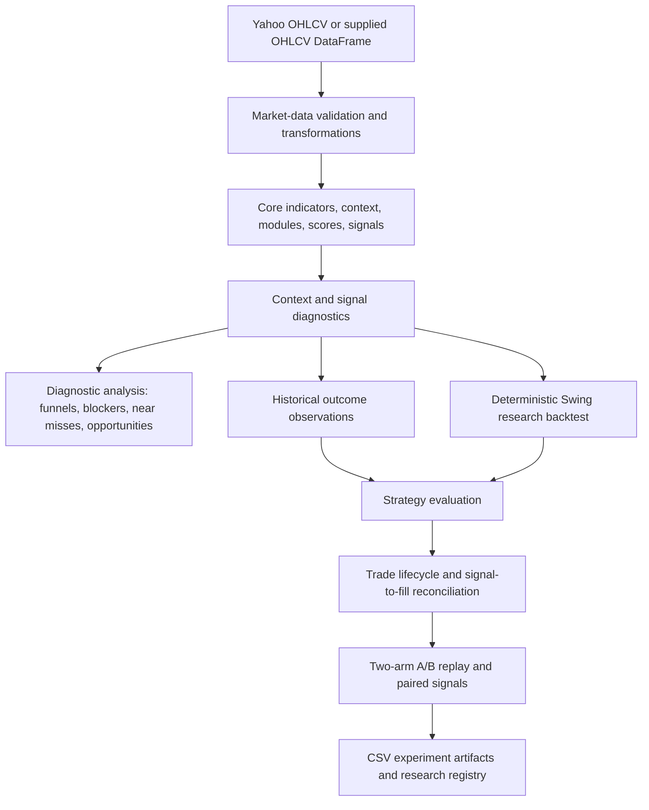

# Trust Me

**Trust Me is a Python-based quantitative trading research system for studying
signals, historical outcomes, and strategy variants.** It turns a modular
trading strategy into a reproducible research workflow: inspect why signals do
or do not occur, simulate an explicit execution model, compare controlled A/B
variants, and preserve the evidence needed to evaluate future changes.

The objective is not simply to produce more signals or maximize one headline
metric. The project asks which setups have historically worked, which have not,
which rules add or remove value, and whether an apparent advantage remains
credible across trades, symbols, years, and market conditions.

> This repository is a research codebase, not a finished autonomous trading
> bot and not evidence of guaranteed profitability.

## Overview

The current research core is Python. It includes:

- normalized Yahoo OHLCV ingestion and time-aware data transformations;
- indicator, context, module, score, and final-signal calculations;
- diagnostic funnels, blockers, near misses, opportunities, and signal
  conversion analysis;
- retrospective fixed-horizon outcomes, MFE, MAE, and target/stop path labels;
- a causal, deterministic Swing research backtest;
- strategy evaluation, trade-lifecycle, stop-path, and signal-to-fill views;
- controlled A/B execution-rule comparisons and paired-signal analysis; and
- versioned CSV artifacts plus a research registry for completed experiments.

TradingView and Pine Script remain important: they are the origin of the
strategy and the authoritative reference for its v2.0 intent. They are not the
current research engine. Pine may also be useful in future alert, signal, or
execution integration, but those integrations are not implemented here.

## Project Evolution

```text
TradingView / Pine Script strategy
                ↓
Python strategy implementation
                ↓
context and signal diagnostics
                ↓
historical outcome analysis
                ↓
deterministic Swing backtesting
                ↓
strategy and trade-lifecycle evaluation
                ↓
controlled A/B experiments
                ↓
module-specific entry/exit research
                ↓
walk-forward and out-of-sample validation
                ↓
future evidence-based TAKE / SKIP decision support
```

Pine Script provided the strategy foundation and a practical environment for
developing its rules. Python became the main research environment because it
supports reproducible diagnostics, programmatic cohort analysis, same-signal
comparisons, multi-symbol experiment artifacts, and a path toward statistical
validation and, eventually, carefully controlled predictive modeling.

The historical project description is retained at
[`reference/README.md`](reference/README.md). It describes earlier plans—such
as Google Sheets workflows, watchlist ranking, automated TradingView refresh,
and live-trade webhooks—that are **not** the present repository architecture.

## Research Philosophy

Trust Me treats a promising result as a hypothesis, not a conclusion.

- Win rate is one metric among several; a high win rate can coexist with poor
  payoff characteristics.
- Mean return and profit factor can be dominated by a small number of extreme
  trades, so medians, trimmed views, tails, and trade-level distributions
  matter.
- Results should be inspected across years, symbols, modules, and regimes—not
  only in aggregate.
- Entry and exit questions should be isolated where possible, with one
  controlled configuration change per A/B experiment.
- Historical in-sample evidence must remain distinct from walk-forward or
  out-of-sample validation.
- Signal frequency and diagnostics are not profitability claims.
- Future-dependent outcomes are retrospective labels, never contemporaneous
  signal features.

The broader objective is robust trade selection and positive expectancy, not
optimization for any single statistic. Good-looking historical results do not
guarantee future performance.

## Strategy Modules

The Python implementation evaluates four entry modules in both long and short
directions:

| Module | Implemented setup, in brief |
| --- | --- |
| **Pullback** | A trend-aligned EMA touch/reclaim with a recent directional RSI cross. |
| **Breakout** | A break beyond a prior rolling price level with strong volume and a recent directional RSI cross. |
| **Squeeze** | A release from a recent Bollinger-bandwidth squeeze through the relevant band. |
| **Mean Reversion** (`MeanRev` in some artifacts) | A trend-aligned recovery from a recent RSI extreme with directional candle confirmation. |

Modules contribute to a confluence score; volatility, candle, session,
direction, and confirmed-bar conditions participate in the final signal. Exact
rules and comparison operators live in `src/trust_me_core.py` and the Pine
reference rather than in this overview.

Module membership may overlap. A **Pure Pullback** cohort contains Pullback
signals without another simultaneously active module; it is not the same
population as Pullback + Breakout. General module-attribution tables are also
overlapping: one trade may appear under every active module, so module rows must
not be added together to reconstruct the strategy total.

## System Architecture



### Core data and timing contracts

- Input OHLCV columns are `open`, `high`, `low`, `close`, and `volume`, indexed
  by a `DatetimeIndex`.
- Final signals are available at the signal bar close; the research backtest
  enters at the next bar open.
- A stop computed after a surviving bar closes applies from the next bar.
- Trend exits are decided at a confirmed close and filled at the next open.
- Daily-to-intraday context mapping uses the prior completed daily value until
  the daily close. Timezone-aware intraday data is required.
- Historical outcomes, completed lifecycle measurements, and A/B differences
  become available only after their observation windows or trades complete.

Python's **Research Execution Semantics** are deliberately separate from
TradingView's broker emulator. No TradingView execution parity is assumed.

## Research Pipeline

1. **Market data** — download and normalize Yahoo data, validate OHLCV, and,
   where needed, resample regular US sessions or map completed daily context.
2. **Core calculations** — compute EMA/ADX trend context, ATR volatility, RSI
   momentum, volume, price structure, the four modules, scores, and signals.
3. **Diagnostics** — preserve context and expose failed requirements, bitmasks,
   margins, near misses, opportunity streaks, and conversion paths.
4. **Historical outcomes** — anchor approved signals or opportunities at bar
   close and measure only subsequent bars.
5. **Execution research** — simulate one Swing position at a time with explicit
   next-open fills and causal stop/trend-exit timing.
6. **Evaluation and lifecycle analysis** — relate trades to module provenance,
   reconcile signals with fills, and measure realized results versus in-trade
   and post-exit excursions.
7. **A/B comparison** — independently replay two configurations against the
   same diagnostics input and pair records by signal time and direction.
8. **Research artifacts** — inspect symbol, year, paired-trade, metadata, and
   failure CSVs; register experiments for later discovery and validation.

## Backtesting and Historical Outcomes

### Deterministic Swing backtest — implemented

`src/backtest.py` implements a causal research model with next-open entries,
ATR stops, an optional trend exit, long and short support, censored end-of-data
positions, a trade ledger, a per-bar state trace, and signal-to-fill
reconciliation. It deliberately models one position at a time.

The simulator reports trade count, wins/losses, win rate, mean and median
return, average winner/loser, return-based profit factor, and expectancy.
Strategy evaluation adds module/direction cohorts; A/B evaluation adds realized
R where initial risk is valid. Trade lifecycle diagnostics report bars held,
exit reason and timing, stop evolution, MFE/MAE (or bounds where an intrabar
point estimate is unknowable), and post-exit observations.

The backtest does **not** currently model an equity curve, portfolio allocation,
position sizing, leverage, commissions, slippage, drawdown, Sharpe ratio, or
multi-asset capital contention. The execution engine is Swing-only.

### Historical Outcome Engine — implemented and separate

`src/historical_outcomes.py` is an observation layer, not a fill or P&L
simulator. For signal and opportunity anchors it can calculate:

- forward returns at fixed horizons;
- maximum favorable excursion (MFE) and maximum adverse excursion (MAE);
- data-completeness/censoring state; and
- target-before-stop, stop-before-target, neither, and ambiguous same-bar path
  outcomes.

The anchor close is a reference price, not an assumed executable fill. This
separation prevents retrospective observations from being confused with the
trade ledger or used as if they had been known at decision time.

## A/B Experiment Framework

`src/ab_rule_testing.py` replays arms A and B independently from the same
unchanged diagnostics data. A real comparison may alter exactly one supported
execution parameter: ATR multiplier, locked/dynamic ATR mode, or trend-exit
enablement. This makes the experiment interpretable while retaining sequence
effects: a changed exit can alter whether a later signal is filled or ignored
because a position remains open.

Aggregate averages alone can hide this behavior. The paired view therefore
matches the **same historical signal** by timestamp and direction and reports:

- whether both arms filled it or only one did;
- each exit, return, realized R, bars held, and lifecycle MFE;
- B-minus-A return and R differences; and
- fill-status changes caused by the sequential path.

Stored research artifacts additionally include year and symbol summaries that
support stability checks, ties/wins by arm, and investigation of tail-sensitive
means. The framework is descriptive: it does not automatically rank a winner,
search a parameter grid, or promote a variant to production policy.

## Exit Research

The current experiment set studies entry cohorts while varying exit behavior:

- **ATR multiplier** controls the distance of the ATR-based trailing stop.
- **Dynamic ATR** recalculates the trailing candidate with the ATR known on
  each completed surviving bar.
- **Locked ATR** uses the signal-time ATR for the trade's trailing candidates.
- In both modes, the active stop moves only in the favorable direction and a
  close-derived update does not apply until the following bar.
- **Trend Exit** optionally requests an exit when price closes through the fast
  higher-timeframe EMA; the research fill occurs at the next open.

Exit research considers win rate, mean and median return, profit factor,
realized R, bars held, paired outcomes, fill-status changes, and year/symbol
stability. Robust interpretation should also inspect trimmed means, tail
sensitivity, and dependence on extreme trades. The variant with the highest
untrimmed mean is not automatically the best policy.

### Current exit research status

The repository does not contain the requested `results/EXIT_POLICY_MATRIX_V1.md`;
the following status is therefore intentionally conservative and based on the
registered experiments and their stored CSVs.

| Module/cohort | Evidence currently stored | Status |
| --- | --- | --- |
| **MeanRev** | Five-year, daily, 50-symbol long-side experiments cover Trend Exit OFF; Dynamic versus Locked ATR; and Dynamic multiplier comparisons around 1.5–2.5. | **Provisional research candidate:** Trend Exit OFF, Dynamic ATR, approximately 2.0× ATR. Final interaction and out-of-sample validation are not recorded as complete. |
| **Pure Pullback** | Five-year, daily, 50-symbol long-side experiments cover Trend Exit ON/OFF, Dynamic/Locked ATR, multiplier comparisons from 1.5–3.0, and final interaction checks at 1.5. | **Research baseline:** Trend Exit ON, Dynamic ATR, approximately 1.5× ATR. This is research evidence, not a proven production policy. |
| **Breakout** | Breakout appears in broad all-module exit summaries, but no complete module-specific experiment sequence is registered. | **Inconclusive / pending validation.** No final policy is asserted. |
| **Squeeze** | Squeeze appears in broad all-module exit summaries, but no complete module-specific experiment sequence is registered. | **Inconclusive / pending validation.** No final policy is asserted. |

These experiments use stored historical samples and can be sensitive to a few
large trades. They are candidate-selection evidence only; completed
walk-forward/out-of-sample confirmation is not present.

Adaptive exits—choosing Dynamic versus Locked ATR or Trend Exit according to a
setup's contemporaneously known context—are a **future research direction**.
No adaptive exit-policy engine is implemented today.

## Entry Research

### Implemented diagnostics

The repository already exposes many inputs needed to study entry quality:
RSI and recent crosses/extremes, ADX, fast/slow EMA relationships, distance and
spread margins, ATR and candle range, volume versus its average, breakout
levels, Bollinger-band squeeze context, pullback state, confluence scores,
module masks, trend/regime context, blocker combinations, near misses, and
opportunity-to-signal conversion.

These diagnostics can ask which requirements block opportunities, which fully
activated setups become signals, and what later price paths followed approved
and blocked observations. They do not themselves prove that a rule is useful.

### Research and validation still to do

Entry research is a major next phase: identify which poor outcomes pass, which
poor outcomes are blocked, which favorable outcomes are accidentally blocked,
and which contemporaneously available combinations distinguish the groups.
Controlled entry-rule experiments, robust cohort definitions, and
walk-forward/out-of-sample validation have not yet been completed as a general
policy-selection system.

## TAKE / SKIP Research Direction

The intended long-term evolution is not:

```text
signal → trade
```

It is closer to:

```text
raw signal
    ↓
diagnostics + market context
    ↓
comparable historical evidence
    ↓
validated confidence / outcome analysis
    ↓
TAKE / SKIP decision support
```

The current code builds the diagnostic, outcome, execution, and experiment
foundations for that direction. It does **not** yet implement an automated
TAKE/SKIP engine, a trained model, confidence calibration, or live decision
service. Any future feature must use only data available at the decision time;
forward outcomes and completed-trade diagnostics must remain labels or
evaluation outputs.

## Research Outputs and Reproducibility

Completed experiment artifacts are organized under:

```text
results/ab_tests/<experiment_id>/
```

Depending on the experiment generation, a folder may contain:

- `experiment_metadata.csv` — configuration and experiment identity;
- `paired_signals.csv` — same-signal outcomes and A/B deltas;
- `symbol_summary.csv` — per-symbol comparisons;
- `year_summary.csv` or `yearly_paired_summary.csv` — temporal stability views;
- module-specific summaries; and
- `failures.csv` — symbols or runs that could not be evaluated.

Artifact schemas vary somewhat across the stored research generations, so
consumers should inspect metadata and columns rather than assume every folder
contains the same files.

`results/research_registry.csv` is the discovery index for recorded research.
It links experiment IDs and configurations to their artifact paths so prior
work can be found, reviewed, and reused instead of repeatedly rediscovered.
This is also groundwork for future research automation.

## Current Project Status

### Implemented

- Python core strategy calculations for Pullback, Breakout, Squeeze, and Mean
  Reversion, with long/short signal paths.
- Yahoo OHLCV access, validation, regular-session resampling, and causal
  daily-to-intraday mapping utilities.
- Context, signal, blocker, near-miss, opportunity, and conversion diagnostics.
- Historical outcome observations and summaries.
- A deterministic, one-position-at-a-time Swing research backtest.
- Strategy evaluation, trade lifecycle, stop path, and signal/fill
  reconciliation.
- Controlled execution-rule A/B replay and paired-signal tables.
- Stored multi-symbol exit-research artifacts and a research registry.

### Research / validation in progress

- Selecting robust module-specific exit candidates, with the strongest stored
  sequences currently covering MeanRev and Pure Pullback.
- Understanding entry filters and context using existing diagnostics.
- Separating genuine improvements from symbol/year instability and extreme
  trade dependence.
- Moving candidate policies toward walk-forward/out-of-sample evaluation.

### Planned

- Formal walk-forward and out-of-sample validation.
- Scanner, watchlist, and ranking layers (`src/live_scanner.py` is currently an
  empty placeholder).
- Evidence-based TAKE/SKIP decision support.
- Context-sensitive adaptive-exit research.
- Predictive analytics or ML only after targets, temporal feature availability,
  time-based splits, leakage controls, and suitable baselines are defined.

## Roadmap

The next architecture milestone is walk-forward/out-of-sample validation. Later
work may add scanner/watchlist/ranking capabilities and then predictive
analysis. This order is deliberate: descriptive in-sample findings should not
become automated decisions before their contracts and validation are sound.

## Repository Structure

```text
trust-me-python/
├── src/
│   ├── trust_me_core.py          # indicators, modules, scores, final signals
│   ├── market_data.py            # Yahoo OHLCV and time-aware transformations
│   ├── diagnostics_*.py          # context, signals, and diagnostic analysis
│   ├── historical_outcomes.py    # retrospective observation outcomes
│   ├── backtest.py               # deterministic Swing execution research
│   ├── strategy_evaluation.py    # trade/module/outcome evaluation
│   ├── trade_lifecycle.py        # holding-period and stop-path diagnostics
│   ├── ab_rule_testing.py        # controlled two-arm replay
│   ├── parity_test.py            # manual Yahoo/Pine-oriented checks
│   └── live_scanner.py           # empty future-layer placeholder
├── tests/                        # deterministic pytest suite and manual scripts
├── results/
│   ├── ab_tests/                 # stored experiment CSV artifacts
│   └── research_registry.csv     # experiment discovery index
├── reference/
│   ├── trust_me_strategy.pine    # authoritative Pine strategy intent
│   ├── RESEARCH_EXECUTION_CONTRACT.md
│   └── README.md                 # historical project description
├── AGENTS.md
├── ARCHITECTURE.md
├── requirements.txt
└── README.md
```

## Installation

Python is required; the repository does not currently declare a narrower
supported-version range or package itself for installation. From the repository
root, create an isolated environment and install the checked-in dependencies:

```bash
python -m venv .venv
source .venv/bin/activate
python -m pip install -r requirements.txt
```

On Windows, activate with `.venv\Scripts\activate`.

## Running the Project

There is no unified command-line application. The modules are research APIs
that are composed from Python, while repository experiments have stored their
outputs as CSV artifacts. A typical in-memory path is:

```python
from src.market_data import download_yahoo_data
from src.diagnostics_signals import signal_diagnostics
from src.strategy_evaluation import evaluate_strategy
from src.ab_rule_testing import run_ab_rule_test

ohlcv = download_yahoo_data("SPY", period="5y", interval="1d")
diagnostics = signal_diagnostics(ohlcv, is_swing=True)

evaluation = evaluate_strategy(diagnostics)
comparison = run_ab_rule_test(
    diagnostics,
    experiment_id="example-dynamic-vs-locked",
    experiment_name="Dynamic versus locked ATR",
    baseline_config={"use_locked_atr": False},
    variant_config={"use_locked_atr": True},
)
```

Yahoo access is network-dependent. Review the function signatures and the
Research Execution Contract before treating outputs as comparable experiments.
The manual parity program can be run with:

```bash
python -m src.parity_test
```

It downloads external data, uses hard-coded comparison bars, and is a manual
diagnostic—not proof of full Pine or TradingView parity.

## Testing

The deterministic regression suite covers core calculations, diagnostics,
historical outcomes, the Swing backtest, strategy evaluation, lifecycle
analysis, A/B comparisons, schema stability, alignment, and causal timing.

With the project environment active:

```bash
PYTHONDONTWRITEBYTECODE=1 python -m pytest -q -p no:cacheprovider
```

Some files named `*_test.py` are manual, network-dependent integration/parity
programs rather than pytest-collected unit tests. Passing unit tests does not
establish Yahoo availability, TradingView parity, or profitable future
performance.

## Limitations

- Walk-forward and out-of-sample validation are not yet implemented as a
  completed project layer.
- Stored exit results are historical research artifacts, not frozen production
  policies; Breakout and Squeeze lack complete registered module-specific
  sequences.
- The backtest is Swing-only and omits costs, slippage, sizing, equity,
  portfolio constraints, and several common risk statistics.
- Intrabar OHLC ordering is unknowable; the lifecycle layer retains uncertainty
  bounds rather than inventing a price path.
- TradingView broker-emulator parity has not been established.
- The scanner, live execution, adaptive policy, TAKE/SKIP engine, and ML layers
  are not implemented.
- Research artifact schemas are not fully uniform across experiment generations,
  and `results/EXIT_POLICY_MATRIX_V1.md` is not present.

## Analytics Perspective

As a data and analytics project, Trust Me demonstrates a progression from data
collection and transformation through descriptive and diagnostic analysis,
experiment design, quantitative evaluation, reproducible artifacts, and
decision-support planning. Predictive analytics and ML are future possibilities,
not current capabilities; the present emphasis is building trustworthy data,
causal timing, and evaluation contracts first.

## Disclaimer

This project is intended for research and educational purposes. Historical
backtest results do not guarantee future performance. Nothing in this
repository is financial advice.
